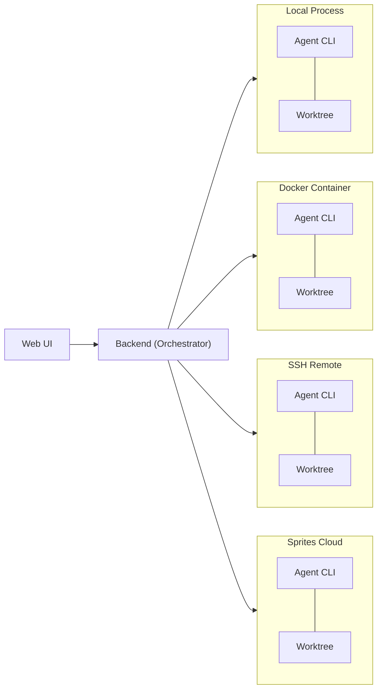

# Kandev

Manage and run tasks in parallel. Orchestrate agents. Review changes. Ship value.

[Features](docs/features.md) | [Workflows](docs/workflow-tips.md) | [Run as a Service](docs/run-as-a-service.md) | [Debug Logs](docs/debug-logs.md) | [Roadmap](docs/roadmap.md) | [Contributing](CONTRIBUTING.md) | [Architecture](docs/ARCHITECTURE.md) | [Discord](https://discord.gg/gWdCPGcFCD)

<p align="center">
  
</p>

[See screenshots](docs/screenshots.md)

## What


Organize work across kanban and pipeline views with opinionated workflows and execute multiple tasks in parallel. Assign agents from any provider, and review their output in an integrated workspace - file editor, file tree, terminal, browser preview, and git changes in one place. Terminal agent TUIs are great for running agents, but reviewing and iterating on changes there doesn't scale.

Run it locally or self-host it on your own infrastructure and access it from anywhere via [Tailscale](https://tailscale.com/) or any VPN.

Open source, multi-provider, no telemetry, not tied to any cloud.

## Vision

> **Humans stay in control.** Define tasks, build agentic workflows with gates, review every change, decide what ships.

- **Review-first** - Humans support production systems. We need to understand (yet) and trust the code that gets deployed.
- **Your workflow** - Every team is different, and not every developer uses AI the same way. Define workflows once, share them across the team, and give everyone a consistent process for working with agents - regardless of experience level.
- **Remote agents** - Running multiple agents on a large codebase can quickly saturate a local machine. The goal is a single control plane: offload execution to servers, orchestrate from anywhere, including your phone.

## Features

- **Multi-agent support** - Claude Code, Codex, GitHub Copilot, Gemini CLI, Amp, Auggie, OpenCode, Cursor, Devin, Qwen, Factory Droid, iFlow, Kilocode, Pi, Kimi, AWS Kiro, Qoder, Trae, Oh My Pi
- **Parallel task execution** – start and manage multiple tasks from different sources simultaneously, boosting productivity with AI agents
- **Integrated workspace** - Built-in terminal, code editor with LSP, git changes panel, embedded vscode and chat in one IDE-like view
- **Kanban task management** - Drag-and-drop boards, columns, and workflow automation
- **Agentic workflows** - Multi-step pipelines that mix-and-match agents per step - for example, Claude Code Opus to design a plan, GitHub Copilot Sonnet to implement it, and Codex GPT 5.4 to review the changes. See [docs/workflow-tips.md](docs/workflow-tips.md)
- **Sub-tasks** - Agents can spawn sub-tasks that resume from the parent task's session. Useful for splitting a task that has grown too big, or producing several PRs from the same starting point.
- **CLI passthrough** - Drop into raw agent CLI mode for direct terminal interaction with any supported agent, leverage the full power of their TUIs
- **Workspace isolation** - Git worktrees prevent concurrent agents from conflicting
- **Multi-repository tasks** - Span a single task across multiple repositories, with one worktree per repo, per-repo branches, per-repo PRs, and per-repo grouping in the Changes panel and review dialog
- **Flexible runtimes** - Run agents as local processes, in isolated Docker containers, on remote servers via SSH, or in cloud executors like sprites.dev
- **Runtime settings** - Executor profiles, secrets, custom prompts, utility agents, voice mode, and resource metrics are configurable from Settings
- **Task-agent MCP** - Agents can create subtasks, target sibling repos, attach extra branches for multiple PRs, message other tasks, read conversations, and inspect related tasks
- **External MCP** - Manage Kandev from outside coding agents over streamable HTTP or SSE, with copyable config snippets for popular agent CLIs
- **Workflow portability** - Export and import workflows as portable YAML across workspaces or Kandev installs
- **Session management** - Resume and review agent conversations
- **Shareable task snapshots** - Publish redacted task conversation snapshots as secret GitHub Gists, with preview and revoke controls
- **Stats** - Track your productivity with stats on the completed tasks, agent turns, etc

See [docs/features.md](docs/features.md) for the full feature inventory, including settings, secrets, custom prompts, and MCP task capabilities.

### In progress: Office mode

We're working on **Office mode**, a feature-flagged autonomy layer for persistent agent teams. The direction is agent instances with roles and permissions, dashboards, inbox/approvals, routines, task delegation, skills, memory, cost tracking, budgets, and workspace config sync. We'll document Office as a supported feature after it is live.

## Integrations

<p align="center">
  <a href="https://github.com/"></a>
  <a href="https://www.atlassian.com/software/jira"></a>
  <a href="https://linear.app/"></a>
  <a href="https://sentry.io/"></a>
  <a href="https://gitlab.com/"></a>
  <a href="https://slack.com/"></a>
</p>

Connect Kandev to the tools your team already uses — pull issues into the kanban, link tasks to PRs, and surface review activity inline.

## Supported ACP Agents

| Agent | Launch |
|:-------:|:----------:|
| **Claude Code** | `npx -y @agentclientprotocol/claude-agent-acp` |
| **Codex** | `npx -y @agentclientprotocol/codex-acp` |
| **GitHub Copilot** | `npx -y @github/copilot --acp` |
| **Gemini CLI** | `npx -y @google/gemini-cli --acp` |
| **Amp** | `npx -y amp-acp` |
| **Auggie** | `npx -y @augmentcode/auggie --acp` |
| **OpenCode** | `opencode acp` |
| **Cursor** | `cursor-agent acp` *(requires Cursor Pro)* |
| **Devin** | `devin acp` *(install Devin CLI from Devin Desktop or standalone installer)* |
| **Qwen** | `npx -y @qwen-code/qwen-code --acp` |
| **Factory Droid** | `npx -y droid exec --output-format acp` |
| **iFlow (beta)** | `npx -y @iflow-ai/iflow-cli --experimental-acp` |
| **Kilocode** | `npx -y @kilocode/cli acp` |
| **Pi** | `npx -y pi-acp` |
| **Kimi** | `kimi acp` *(install Kimi CLI from Moonshot AI)* |
| **Kiro** | `kiro-cli-chat acp` *(install Kiro CLI from AWS)* |
| **Qoder** | `qodercli --acp` *(install Qoder CLI)* |
| **Trae** | `traecli acp serve` *(install Trae IDE CLI)* |
| **Oh My Pi** | `omp acp` *(install `bun install -g @oh-my-pi/pi-coding-agent`)* |

> All agents communicate via [ACP](https://agentclientprotocol.com) (Agent Client Protocol). Some agents support ACP natively, while others use ACP adapter packages that bridge their native protocols. **CLI Passthrough mode** is also available for direct terminal interaction with any agent CLI. If your agent isn't supported yet, open an issue or submit a PR with the integration. See [Adding a New Agent CLI](docs/add-agent-cli.md) for a step-by-step guide.

### Bring your own TUI agents

Kandev can run any agent CLI as a TUI inside a terminal, even when it does not speak ACP. Add the command in agent profile settings and the task starts that agent inside a PTY terminal. CLI passthrough keeps the agent's native terminal UX available while still giving Kandev task tracking, worktrees, review, and session management.

## Supported Executors

| Executor | Description |
|:--------:|-------------|
| **Local Process** | Runs the agent as a local process on the host machine |
| **Docker** | Runs the agent in an isolated Docker container |
| **SSH** | Runs the agent on a remote server over SSH |
| **Sprites** | Runs the agent in a remote cloud environment via [sprites.dev](https://sprites.dev) |

Executors support profiles for reusable runtime configuration: prepare scripts, environment variables, credentials, and settings. Worktree-based tasks can also attach multiple repositories or multiple branches from the same repository, which lets one task produce several PRs when the work needs it.

## Quick Start

### Homebrew (macOS, Linux)

```bash
brew install kdlbs/kandev/kandev
kandev
```

### NPX

```bash
npx kandev@latest
```

Requires npm 7+. Installs the CLI plus a platform-matched runtime bundle in one step.

### NPM (global)

```bash
npm install -g kandev@latest
kandev
```

### Updates

- `brew upgrade kandev`
- `npx kandev@latest` (always uses the latest published version)
- `npm install -g kandev@latest`

The worktrees and sqlite db live in `~/.kandev` by default. Works on macOS, Linux, and Windows (WSL or native).

### From Source

```bash
# Clone the repository
git clone git@github.com:kdlbs/kandev.git
cd kandev

# Start in production mode
make start
```

**Prerequisites:** Go 1.26+, Node.js 18+, pnpm, Docker (optional - needed for container runtimes)

## High level architecture



We also want to add support for this remote runtime:
- **K8s operator** - run agents in a Kubernetes cluster, with auto-scaling and resource management.

<details>
<summary><strong>Development</strong></summary>

### Project Structure

```
apps/
├── backend/    # Go backend (orchestrator, lifecycle, agentctl, WS gateway)
├── web/        # Next.js frontend (SSR, Zustand, real-time subscriptions)
├── cli/        # CLI tool (npx kandev launcher)
├── landing/    # Landing page
└── packages/   # Shared UI components & types
```

### Prerequisites

- [mise](https://mise.jdx.dev/) for the pinned toolchain in `mise.toml` (`make bootstrap` installs it when missing)
- Go 1.26, Node.js 24, pnpm 9.15.9 (installed by `make bootstrap`)
- Docker (optional)

### Environment Setup

```bash
# Install mise tools, workspace dependencies, and git hooks
make bootstrap

# Also install Playwright Chromium browser/deps for E2E
make bootstrap-e2e
```

### Running Dev Servers

```bash
# Start everything (backend + frontend with auto ports)
make dev

# Or run separately
make dev-backend    # Backend on :38429
make dev-web        # Frontend on :37429
```

### Testing & Linting

```bash
make test           # Run all tests (backend + web)
make lint           # Run all linters
make typecheck      # TypeScript type checking
make fmt            # Format all code
```

### Pre-commit Hooks

```bash
# Installed and wired by make bootstrap
make doctor
```

</details>

## Comparison to Other Tools

There are a few similar tools in this space, and new ones appearing everyday. Here's what sets this one apart:

- **Server-first architecture** - The core app runs as a server you can access from any device, including your phone.
- **Remote runtimes** - Run agents on remote servers via SSH, Docker hosts, and cloud environments, not just your local machine.
- **Multi-provider** - Use Claude Code, Codex, Copilot, Gemini, Amp, Auggie, OpenCode, Cursor, Devin, Qwen, Droid, iFlow, Kilocode, Pi, Kimi, Kiro, Qoder, Trae, and Oh My Pi side by side. Not locked to one vendor.
- **CLI passthrough and chat** - Interact with agents through structured chat messages or drop into raw CLI mode for full agent TUI capabilities.
- **Open source and self-hostable** - No vendor lock-in, no telemetry, runs on your infrastructure.

## Contributing

Contributions are welcome! Please read [CONTRIBUTING.md](CONTRIBUTING.md) before opening a PR.

See the [issue tracker](https://github.com/kdlbs/kandev/issues) for open tasks, or join our [Discord](https://discord.gg/gWdCPGcFCD) to chat with maintainers and other contributors.

## Acknowledgments

Built with these excellent open-source projects:

[Monaco Editor](https://microsoft.github.io/monaco-editor/) · [Tiptap](https://tiptap.dev/) · [xterm.js](https://xtermjs.org/) · [dockview](https://dockview.dev/) · [CodeMirror](https://codemirror.net/) · [dnd-kit](https://dndkit.com/) · [Mermaid](https://mermaid.js.org/) · [Recharts](https://recharts.org/) · [TanStack Table](https://tanstack.com/table) · [Zustand](https://zustand.docs.pmnd.rs/) · [Shadcn/UI](https://ui.shadcn.com/) · [Radix UI](https://www.radix-ui.com/) · [Tailwind CSS](https://tailwindcss.com/)

## License

[AGPL-3.0](LICENSE)

## Star History

<a href="https://www.star-history.com/?repos=kdlbs%2Fkandev&type=date&legend=top-left">
 <picture>
   <source media="(prefers-color-scheme: dark)" srcset="https://api.star-history.com/chart?repos=kdlbs/kandev&type=date&theme=dark&legend=top-left" />
   <source media="(prefers-color-scheme: light)" srcset="https://api.star-history.com/chart?repos=kdlbs/kandev&type=date&legend=top-left" />
   
 </picture>
</a>
