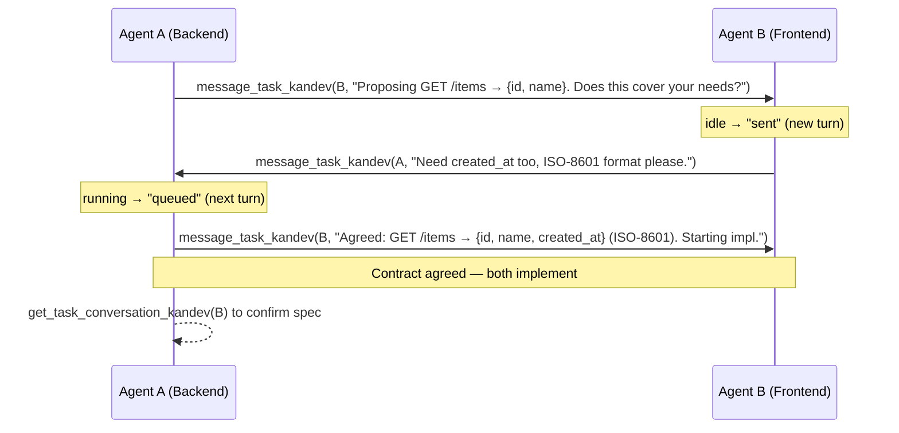

# Agent Communication

Agents running in separate Kandev tasks can talk to each other directly. One agent sends a structured prompt to another task; the receiving agent processes it as a normal turn and sends its reply back the same way. This closes the loop into a genuine two-way conversation without any additional infrastructure.

Communication works across all relationship types — parent to child, child to parent, sibling to sibling, and tasks in entirely different workspaces or workflows ("projects"). The only requirement is that each agent knows the other task's full UUID.

## Discovering task IDs

An agent typically learns a peer's task ID in one of three ways:

**From related tasks.** `list_related_tasks_kandev` returns parent, children, siblings, blockers, and blocked-by tasks for the current task. Each entry includes the full task UUID, title, lifecycle state, and associated pull requests — but not the workflow step (kanban column). To check which column a related task currently sits in, look it up with `list_tasks_kandev` on its workflow.

```
list_related_tasks_kandev()
# → { "children": [{ "id": "uuid-of-B", "title": "Frontend: Item list" }], ... }
```

**From a creation return value.** `create_task_kandev` returns the newly created task's ID. A coordinator that spawns subtasks immediately holds every child's UUID and can message them as soon as they start.

**By browsing the board.** `list_workspaces_kandev` → `list_workflows_kandev` → `list_tasks_kandev` lets an agent walk the full board structure, including tasks in other workspaces. Because `message_task_kandev` accepts any task UUID, cross-project messaging (tasks in separate workflows or workspaces) works without special configuration.

## Sending a message

```
message_task_kandev(task_id="<full UUID>", prompt="<message text>")
```

By default, the message goes to the task's primary session. Advanced callers can pass
`session_id` to target a specific session that belongs to that task, including a sibling
session on their own task. `spawn_session_kandev` returns `{task_id, session_id, state}`
when an agent starts an additional session on an existing task; pass the `session_id` field to `message_task_kandev`.

Delivery behaviour depends on the target session's state at the moment of the call:

| Target session state | What happens | Return value |
|---|---|---|
| Running or starting | Message is queued; delivered when the current turn ends | `"queued"` |
| Running or starting, direct parent uses `delivery_mode="interrupt"` | Kandev queues the message, then tries to interrupt the current turn and deliver it immediately | `"sent"` if interrupted and delivered immediately; otherwise `"queued"` |
| Idle (waiting for input, or turn just finished) | Message starts a new turn immediately | `"sent"` |
| Created (agent not yet started) | Agent is started with this message as its first prompt | `"started"` |
| Failed or cancelled | Error is returned | — |

The `queued` outcome is normal and correct. It does not mean the message was dropped; it means the receiving agent will process it on its very next turn. Design your messages to be self-contained so that a small delay between delivery and processing does not matter.

A direct parent task has one extra option for steering a child that is already running:
`delivery_mode="interrupt"`. Kandev first persists the message in the queue, then
attempts to cancel the child's current turn and deliver that queued message immediately.
If the interrupt cannot dispatch immediately, the message stays safely queued for the
normal turn-completion drain. This mode is intentionally restricted to the target task's
direct parent; any other sender that requests `interrupt` receives a hard error instead
of being silently downgraded to `queued`.

## Receiving and replying

The receiving agent processes the incoming message as an ordinary user turn. It can use any tool, read code, run tests, and reason freely before formulating its response.

To reply, the agent calls `message_task_kandev` with the **originating task's ID** and the response text. That message becomes a new turn in the sender's conversation — closing the loop into a bidirectional exchange.

```
# Agent B, replying to Agent A after receiving a proposal:
message_task_kandev(
  task_id="<Agent A's task UUID>",
  prompt="Acknowledged. I need created_at in the response too. ISO-8601 format preferred."
)
```

There is no persistent channel or shared socket between tasks. Each `message_task_kandev` call is discrete. The conversation thread is implicit — both tasks can recover context by reading back the relevant messages (see [Reading the thread](#reading-the-thread) below).

## Reading the thread

`get_task_conversation_kandev(task_id)` returns the message history for any task you know the ID of. Use it to:

- verify what the other task agreed to, before starting implementation;
- resume context after a long pause;
- audit what was actually communicated.

Pagination and filtering are available via `limit`, `before`, `after`, `sort`, and `message_types` parameters. `message_types=["message"]` returns every regular chat/prompt row — the same `message` type covers ordinary user turns and cross-task deliveries alike, so this filter alone does not isolate coordination traffic. To identify a message that arrived via `message_task_kandev`, check the returned message's `metadata.sender_task_id` (and `sender_task_title`): messages sent within the same task have no `sender_task_id`. Include `"tool_call"` in `message_types` to see tool outputs too.

## Worked example — API contract negotiation

Backend Task A and Frontend Task B need to agree on an API contract before they both start implementing. Neither task knows what the other needs; they resolve it through a short negotiation.

### Setup

Task A (backend) was created by a coordinator. The coordinator also created Task B (frontend) and passed both task IDs to each agent in their initial prompts.

### The exchange



### Agent A's actual tool calls (turn by turn)

**Turn 1 — propose the contract:**

```
message_task_kandev(
  task_id="frontend-task-uuid",
  prompt="""
  I'm Agent A on the backend task (task ID: backend-task-uuid, repo: api, branch: feat/items-endpoint).
  Proposing the following API contract for the /items endpoint:

  GET /items
  Response: { "items": [{ "id": string, "name": string }] }

  Does this cover your frontend needs? Reply with any required changes or "agreed".
  """
)
# → "sent" (Task B was idle)
```

**Turn 2 — Task B's reply arrives as a new user turn in Task A's conversation:**

```
# Incoming turn (user message in A's conversation):
# "Need created_at too; ISO-8601 format preferred."

# Agent A accepts and confirms:
message_task_kandev(
  task_id="frontend-task-uuid",
  prompt="""
  Agreed. Updated contract:

  GET /items
  Response: { "items": [{ "id": string, "name": string, "created_at": string }] }
  Format: created_at is ISO-8601 (e.g. "2024-01-15T10:30:00Z").

  I'm starting implementation now. Let me know if anything changes.
  """
)
# → "queued" (Task B was running its own turn)
```

**Turn 3 — verify before writing tests:**

```
get_task_conversation_kandev(
  task_id="frontend-task-uuid",
  message_types=["message"],
  sort="asc"
)
# Returns the full exchange; Agent A confirms the agreed spec before writing tests.
```

### What Agent B does

Task B processes each incoming message as a normal turn. When it receives Agent A's proposal, it reads the current frontend component that consumes the API, identifies the missing field, and sends back a specific counter-proposal. When the agreement arrives, it proceeds to implement its API client with the agreed shape.

## Good practices

**Be self-contained.** Each message should include enough context for the receiving agent to act without looking up prior conversation history — task ID, repo, branch, current status, and what you expect in return.

**One bounded question at a time.** Cross-task messages work best for specific, answerable requests ("does this schema cover your needs?"), not open-ended collaboration. Keep the negotiation short.

**Verify before implementing.** After reaching agreement, read the other task's conversation with `get_task_conversation_kandev` to confirm the final state before writing code that depends on it.

**Avoid loops.** Do not enter an infinite exchange. Agree on a clear stopping condition (e.g. "reply with 'agreed' or a specific counter-proposal") and implement after at most two or three rounds.

**No secrets or large dumps.** Messages are coordination, not a code-delivery channel. Do not send credentials, private keys, or large file contents through cross-task messages. Reference files by path; share access via the repository, not the message.

**Failed/cancelled tasks cannot receive messages.** If `message_task_kandev` returns an error, the target task is in a terminal state. Create a fresh task with `create_task_kandev` and start over.

## Related built-in actions

These tools complement cross-task communication for common coordination patterns. The full MCP surface is documented in [Automation and MCP](automation-and-mcp.md).

| Tool | Use for |
|---|---|
| `message_task_kandev` | Send a prompt to any task by UUID |
| `get_task_conversation_kandev` | Read a task's message history (pagination, type filters) |
| `list_related_tasks_kandev` | Discover parent / child / sibling / blocker task IDs |
| `create_task_kandev` | Delegate work to a new subtask; returns the new task's ID |
| `spawn_session_kandev` | Start another session on an existing task; returns `{task_id, session_id, state}` — use the `session_id` field to message the new session directly |
| `move_task_kandev` | Hand off a task to the next workflow step with an optional prompt for the receiving agent |
| `create_task_plan_kandev` | Record an agreed implementation plan (both tasks can create/update their own plans) |
| `get_task_plan_kandev` | Read a task's plan — useful before messaging to share a structured proposal |
| `step_complete_kandev` | Signal that the current workflow step is done (task-mode only) |
| `ask_user_question_kandev` | Escalate to a human when agent negotiation cannot resolve a question |

Related: [Coordinate Work](coordination.md), [Automation and MCP](automation-and-mcp.md), [Tasks and workflows](tasks-and-workflows.md).
