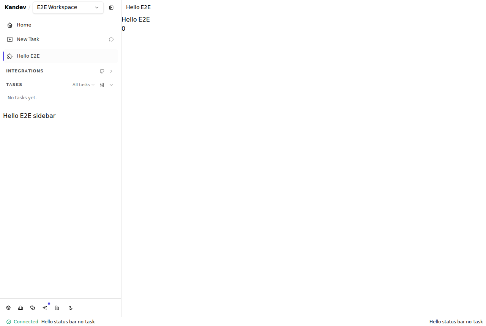

# Authoring a Plugin

This is a build tutorial for a kandev plugin: a Go backend spawned by kandev
over gRPC, with an optional native frontend bundle. See [Plugins](plugins.md)
for the operator-facing install/enable/disable flow, and the [Plugin manifest
reference](plugins-manifest.md) for the full `manifest.yaml` schema.

The fastest way to start is the
[`kdlbs/kandev-plugin-template`](https://github.com/kdlbs/kandev-plugin-template)
starter repo — click **Use this template** on GitHub for a minimal, working
plugin with the layout, build/package `Makefile`, tests, and a tag-triggered
release workflow already wired up. This guide explains what that scaffold
contains and how to extend it.

Two more example plugins go deeper on specific surfaces:

- `kandev-plugin-hello` — a nav item, native route, sidebar slot component, a
  WS-driven counter, a Host-state-backed event handler, and a webhook.
- `kandev-plugin-github` — a connector PoC that shells out to the `gh` CLI
  from a webhook handler used as a request relay, reads live kanban data from
  the host store, and opens kandev's real create-task dialog
  (`host.ui.TaskCreateDialog`) prefilled from a pull request.

## Prerequisites

- Go (matching the version in `apps/backend/go.mod`).
- The kandev plugin SDK, `github.com/kandev/kandev/pkg/pluginsdk`. It is
  **not yet published as a standalone Go module** — it lives inside the
  kandev monorepo (`apps/backend/pkg/pluginsdk`), so a plugin repo develops
  against a local checkout via a `replace` directive:

  ```go
  // go.mod
  module my-plugin

  require github.com/kandev/kandev v0.0.0-00010101000000-000000000000

  replace github.com/kandev/kandev => ../kandev/apps/backend
  ```

  Adjust the relative path to wherever you've checked out the kandev repo.
  This is what both example plugins do; see their `go.mod` for the exact
  pinned dependency versions.

## Backend: minimal plugin

A plugin backend implements `pluginsdk.Plugin` and calls `pluginsdk.Serve`,
which owns the entire go-plugin/gRPC transport — handshake, plugin map, and
Host injection. There is no HTTP server, no listen address, and no
credentials to configure.

> **Language.** The backend is any native executable that speaks the
> hashicorp/go-plugin gRPC protocol (magic-cookie handshake, AutoMTLS, the
> `kandev.plugin.v1` services) — kandev just spawns the platform binary and
> talks to it over that wire. Go is the only SDK kandev ships today, so this
> guide is Go; another language means implementing the handshake, mTLS, and
> proto yourself.

```go
// main.go
package main

import "github.com/kandev/kandev/pkg/pluginsdk"

func main() {
	pluginsdk.Serve(&myPlugin{})
}
```

```go
// plugin.go
package main

import (
	"context"

	"github.com/kandev/kandev/pkg/pluginsdk"
)

type myPlugin struct {
	pluginsdk.UnimplementedPlugin // embed to get HostSetter + no-op defaults
}

var _ pluginsdk.Plugin = (*myPlugin)(nil)
```

`pluginsdk.Plugin` is the interface kandev calls into:

```go
type Plugin interface {
	// OnEvent handles a single bus event delivery. A non-nil error causes
	// kandev to retry (3 retries, 5s/15s/45s backoff).
	OnEvent(ctx context.Context, e *Event) error

	// HandleWebhook handles an inbound request relayed from
	// POST /api/plugins/{id}/webhooks/{key}.
	HandleWebhook(ctx context.Context, req *WebhookRequest) (*WebhookResponse, error)
}
```

Embed `pluginsdk.UnimplementedPlugin` and override only the methods you need
— it's a no-op base that also implements `HostSetter`, so `Serve` injects a
live `Host` into your plugin once the broker connection back to kandev is
established (retrieve it later via `p.Host()`).

## Webhooks

Declare each webhook key in `manifest.yaml`. Kandev relays `GET` and `POST`
requests for `/api/plugins/<id>/webhooks/<key>` to `HandleWebhook`; undeclared
keys return `404`. Request bodies are limited to **4 MiB** and requests that
exceed the limit return `413` before reaching the plugin. Kandev does not
authenticate webhook callers or enforce the manifest's informational `method`,
so validate the HTTP method and the upstream provider's signature before any
side effect.

## The Host API

A plugin calls back into kandev through the injected `Host`:

```go
type Host interface {
	GetState(ctx context.Context, scope, scopeID, key string) (value map[string]any, found bool, err error)
	SetState(ctx context.Context, scope, scopeID, key string, value map[string]any) error
	DeleteState(ctx context.Context, scope, scopeID, key string) error
	ListState(ctx context.Context, scope, scopeID string) ([]StateEntry, error)

	// GetConfig returns the plugin's own operator-editable config (set via
	// Settings > Plugins > <plugin>, generated from manifest config_schema).
	// Ungated — always readable, secret values included. Kandev restarts a
	// running plugin when its config changes, so re-read at startup.
	GetConfig(ctx context.Context) (map[string]any, error)

	// GetSecret/SetSecret/DeleteSecret manage a plugin-owned secret in
	// kandev's encrypted vault, namespaced to this plugin. Require the
	// `secrets` capability.
	GetSecret(ctx context.Context, key string) (value string, found bool, err error)
	SetSecret(ctx context.Context, key, value string) error
	DeleteSecret(ctx context.Context, key string) error

	// RevealSecret resolves an operator-provided secret reference (e.g. a
	// config value pointing at a shared kandev secret) to its cleartext
	// value. For secrets the plugin itself owns, use GetSecret/SetSecret.
	RevealSecret(ctx context.Context, ref string) (string, error)

	EmitEvent(ctx context.Context, name string, payload map[string]any) error

	// Tasks/Sessions/Workspaces/Workflows/AgentProfiles/Repositories return
	// read-only accessors for the Host data API (ADR 0043), each gated on
	// its own capabilities.api_read entry (e.g. "tasks", "sessions").
	// Write RPCs (capabilities.api_write) are reserved and not yet
	// implemented.
	Tasks() TaskReader
	Sessions() SessionReader
	Workspaces() WorkspaceReader
	Workflows() WorkflowReader
	AgentProfiles() AgentProfileReader
	Repositories() RepositoryReader

	// Messages reads historical user/agent conversation content
	// (capability api_read:messages). kandev-injected system blocks are
	// stripped; raw system prompts are never returned.
	Messages() MessageReader

	// InvokeUtilityAgent runs a one-shot completion using this plugin's
	// selected utility agent (capability agent_invoke). No API key of your
	// own; FailedPrecondition when no valid enabled agent is selected.
	InvokeUtilityAgent(ctx context.Context, prompt string) (string, error)
}
```

**Host state** is a small key/value store kandev keeps for your plugin in
its own database. Each entry is addressed by a `(scope, scopeID, key)`
triple and holds a JSON object (`map[string]any`): `SetState` upserts one,
`GetState` reads it back (`found` is `false` when the key was never set),
`DeleteState` removes it, and `ListState` returns every entry under a
`(scope, scopeID)`. Values are JSON objects, not bare scalars — wrap a
number as `map[string]any{"n": 3}`. State is namespaced per plugin (kandev
injects your plugin id server-side, so no plugin can read or write
another's), survives restarts, is captured by kandev's database backups, and
is deleted when the plugin is uninstalled. Reach for it when you want kandev
to durably remember something small and structured for you; use the writable
data directory below for arbitrary files you'd rather manage yourself.

`scope` partitions that store by what a value belongs to: `instance` (the
whole kandev instance; `scopeID` empty), or `workspace` / `task` / `agent`
with `scopeID` set to that entity's id. A per-task counter, for example, is
`SetState(ctx, "task", taskID, "count", map[string]any{"n": 3})` — kept
separate from every other task's.

`EmitEvent` publishes `plugin.<your-plugin-id>.<name>` on kandev's internal
event bus for delivery to any subscriber (including other plugins).

The data-reader accessors return typed, paginated readers — e.g.
`host.Tasks().List(ctx, TaskFilter{...}, Page{Limit: 50})` returns
`([]Task, *PageInfo, error)` with an opaque `PageInfo.NextCursor` for the
next page. See `pkg/pluginsdk/data_types.go` for the full `Task`,
`Workspace`, `Workflow`, `WorkflowStep`, `AgentProfile`, `Repository`,
`Session`, `Message`, and filter/page types.

`host.Messages().List(ctx, MessageFilter{...}, Page{...})` reads historical
conversation content (capability `api_read:messages`). Filter by `SessionIDs`,
`TaskIDs`, a `Since`/`Until` `created_at` window (RFC3339; `Since` inclusive,
`Until` exclusive — the natural way to fetch "yesterday"), and message
`Types`. Each `Message` carries `id`, `session_id`, `task_id`, `turn_id`,
`author_type` (`user` or `agent`), `content`, `type`, and `created_at`.
`content` has kandev's injected `<kandev-system>` blocks stripped — a plugin
never sees raw system prompts.

`host.InvokeUtilityAgent(ctx, prompt)` runs a one-shot, non-interactive LLM
completion using the utility agent selected for this plugin in **Settings >
Plugins > `<plugin>`** (capability `agent_invoke`), and returns its text. Declare
the selector in `manifest.yaml`:

```yaml
capabilities:
  agent_invoke: true

config_schema:
  type: object
  properties:
    utility_agent:
      type: string
      format: utility-agent
      title: Utility Agent
      description: Agent used for this plugin's LLM calls
  required: ["utility_agent"]
```

The picker displays configured built-in and custom agent names but stores the
selected agent's stable ID. Omit `utility_agent` from `required` only when the
plugin supports operating without LLM delegation; optional selectors include a
**Not set** choice. The plugin needs no provider API key because it delegates to
a kandev-configured agent. A missing, deleted, or disabled selection returns
gRPC `FailedPrecondition`, so handle that as "ask the operator to configure
one" rather than a transient failure. This is the LLM step behind, e.g., a
"summarize yesterday" plugin: read the conversation with `host.Messages()`,
then summarize it with `host.InvokeUtilityAgent(...)`.

**Capability gating.** Every Host RPC except `GetConfig` and `EmitEvent` is
checked against your manifest's `capabilities` before the handler runs:
`GetState`/`SetState`/`DeleteState`/`ListState` require
`capabilities.state: true`; `GetSecret`/`SetSecret`/`DeleteSecret`/
`RevealSecret` require `capabilities.secrets: true`; `InvokeUtilityAgent`
requires `capabilities.agent_invoke: true`; each data-reader accessor requires
its resource in `capabilities.api_read` (e.g. `tasks`, `sessions`, `messages`,
`workspaces`, `workflows`, `agent_profiles`, `repositories`).
Calling one without the declared capability returns gRPC `PermissionDenied`
with a message naming the missing capability — declare what you use.

**Writable data directory.** Kandev injects `KANDEV_PLUGIN_DATA_DIR` into
every spawned plugin subprocess — a per-plugin writable directory
(`~/.kandev/plugins/<id>/data`) for anything you'd rather keep on disk than
in `Host` state.

```go
func (p *myPlugin) OnEvent(ctx context.Context, e *pluginsdk.Event) error {
	host := p.Host()
	if host == nil {
		return nil // broker dial still in progress
	}
	// Read the current count (found == false the first time), then write it back + 1.
	value, _, err := host.GetState(ctx, "instance", "", "count")
	if err != nil {
		return err
	}
	n, _ := value["n"].(float64) // JSON numbers decode as float64
	return host.SetState(ctx, "instance", "", "count", map[string]any{"n": n + 1})
}
```

## Optional: native UI

A plugin may ship `ui.bundle` in its manifest: a **hand-written, no-build**
plain-JS ES module. There is no bundler step — kandev serves the file
verbatim from the extracted package directory, so you edit the bundle and
repackage.



The single entry point: the bundle, once evaluated, calls
`window.registerKandevPlugin(id, { initialize(registry, host), destroy?() })`.
Kandev's frontend host imports the bundle on boot (or on runtime enable),
then calls `initialize(registry, host)`. On disable/uninstall it calls
`destroy?.()` and bulk-revokes every registration the plugin made.

**Registry surface** (`registry: PluginRegistry`, passed to `initialize`):

```ts
interface PluginRegistry {
  // Top-level SPA route, exact-match against window.location path. The host
  // wraps the page in kandev's title bar by default; configure or opt out
  // via options.topbar.
  registerRoute(path: string, Component: React.ComponentType, options?: PluginRouteOptions): void;
  // Sidebar/main nav entry, rendered by <PluginNavItems/>.
  registerNavItem(item: NavItem): void;
  // Route under /settings/plugins/{id}/..., rendered inside the settings shell.
  registerSettingsRoute(path: string, Component: React.ComponentType): void;
  // Named slot injection. Initial slots: "task-sidebar", "settings-nav",
  // "main-nav-footer", "chat-input-actions", "chat-top-bar", "main-top-bar",
  // "app-status-bar-left", "app-status-bar-right", and "plugin-settings"
  // (see "Named slots" below).
  registerComponent(slot: string, Component: React.ComponentType<{ slotProps?: unknown }>): void;
  // WS action handler, bridged into the existing lib/ws dispatch.
  registerWsHandler(action: string, handler: (payload: unknown) => void): void;
}

interface NavItem {
  id: string;
  label: string;
  path: string;
  // Curated icon name (see lib/plugins/icons.ts); unknown names render the puzzle glyph.
  icon?: string;
  // "main" (default): top-level sidebar entry. "integrations": renders inside
  // the sidebar's Integrations section alongside first-party integration links.
  // "settings" is accepted by the type but not rendered by any sidebar section
  // today — for a settings page use registerSettingsRoute instead.
  section?: "main" | "settings" | "integrations";
}

interface PluginRouteOptions {
  // Kandev-style title bar above the page. Default: enabled with a derived
  // title (from the matching nav item, else the plugin's display name).
  // Pass a PluginPageChrome to configure it, or `false` for a full-bleed
  // page that owns its own chrome (e.g. with host.ui.PageTopbar).
  topbar?: boolean | PluginPageChrome;
}

interface PluginPageChrome {
  title?: string;
  subtitle?: string;
  icon?: string;               // same curated set as NavItem.icon
  backHref?: string;           // default "/"
  backLabel?: string;          // default "Kandev"
  actions?: React.ComponentType; // rendered on the right side of the topbar
}
```

**Host API** (`host: PluginHostApi`, passed to `initialize`):

```ts
interface PluginHostApi {
  pluginId: string;
  React: typeof import("react");       // shared host React instance — MUST use this, never bundle your own React
  jsx: typeof React.createElement;     // convenience alias
  store: {                              // kandev's live app store — read access is the common
    getState(): AppState;               // case; setState is exposed but writes affect the whole SPA
    setState(partial): void;
    subscribe(listener): () => void;
  };
  api: {
    // fetch scoped to /api/plugins/{id}/...; relayed to your webhook handler.
    fetch(path: string, init?: RequestInit): Promise<Response>;
    // Backend API origin ("" when the SPA and API share an origin) — lets a
    // plugin reach first-party kandev REST endpoints directly.
    baseUrl: string;
  };
  ui: Record<string, unknown>;          // curated @kandev/ui subset — see below
  theme: "light" | "dark";
  // Soft SPA navigation (history push/replace), same as the app's own router.
  navigate(href: string, options?: { replace?: boolean }): void;
}
```

A plugin bundle must render with `host.React` / `host.jsx` — bundling your
own React copy breaks hook identity against the host tree.

`host.ui` is a curated `@kandev/ui` subset — Alert, Badge, Button, Card,
Checkbox, Dialog, DropdownMenu, Input, Label, Pagination, ScrollArea, Select,
Separator, Sheet, Skeleton, Spinner, Switch, Table, Tabs, Textarea, Tooltip
(each with their compound sub-parts, e.g. `DialogContent`, `TableRow`) — plus
first-party app UI: `Combobox` (the app's picker), `PageTopbar` (the title
bar a route gets by default via `registerRoute`'s `options.topbar`, exposed
here for routes that opt out and render their own chrome), and
`TaskCreateDialog`, so a plugin can hand off task creation to kandev's real
create-task flow (repo/branch/agent pickers, validation) instead of POSTing
directly. See `apps/web/lib/plugins/host-api.ts` for the exact current list.

## Named slots

`registerComponent(slot, Component)` injects a component into a host-defined
slot. The host renders every plugin's component for that slot (each isolated
behind an error boundary), so a slot may hold contributions from several
plugins at once. Available slots:

| Slot | Where it renders | `slotProps` |
| --- | --- | --- |
| `task-sidebar` | Bottom of the task-detail sidebar | — |
| `settings-nav` | Settings navigation tree | — |
| `main-nav-footer` | Footer of the main sidebar | — |
| `chat-input-actions` | Chat composer toolbar, beside the model picker, mic, and send button | `{ taskId, taskTitle, activeSessionId, sessionIds }` |
| `chat-top-bar` | Session top bar, beside the CPU/DB metrics and the document/editor/debug controls | `{ taskId, taskTitle, workspaceId, activeSessionId, sessionIds }` |
| `main-top-bar` | Default app top bar (Home / Kanban / Tasks), beside the CPU/DB metrics and the view/display controls | `{ workspaceId, workspaceLabel, currentPage }` |
| `app-status-bar-left` | Default-left item in the global status surface | `AppStatusBarSlotProps` |
| `app-status-bar-right` | Default-right item in the global status surface | `AppStatusBarSlotProps` |
| `plugin-settings` | A plugin's own settings page (**Settings > Plugins > `<plugin>`**), at the top above the settings form | `{ pluginId, status }` |

`plugin-settings` is the one exception to "every plugin's component renders":
it is **owner-scoped**, so the host renders only the component registered by the
plugin whose settings page is being viewed. See "Plugin settings page" below.

### Chat toolbar actions

Register a `chat-input-actions` component to add an icon button to the chat
composer toolbar. The host passes the current context as `slotProps`:

```ts
type ChatInputActionsSlotProps = {
  taskId: string | null;
  taskTitle?: string;
  activeSessionId: string | null; // session the composer is bound to
  sessionIds: string[];           // every kandev session id on the task
};
```

A task can hold several sessions, so both the active session and the full
`sessionIds` list are provided. These are **kandev** session ids — resolving one
to an agent/ACP transcript id (for example, to key per-session cost data from a
tool like tokscale) is your plugin's job. Do that **server-side in your plugin
backend** via the Host data API (`host.Sessions()` exposes each session's
`ACPSessionID`), not in the bundle: propagate the ids from the UI to your
backend over `host.api.fetch(...)`, and let the backend do the matching.

```js
function makeChatAction(host) {
  const { jsx: h, ui } = host;
  const { Button, Tooltip, TooltipTrigger, TooltipContent } = ui;

  return function ChatAction({ slotProps }) {
    const { taskId } = slotProps ?? {};
    return h(
      Tooltip,
      null,
      h(
        TooltipTrigger,
        { asChild: true },
        h(
          Button,
          {
            type: "button",
            variant: "ghost",
            size: "icon",
            className: "h-7 w-7 cursor-pointer hover:bg-muted/40",
            "aria-label": "Open plugin page",
            onClick: () => host.navigate("/hello-world"),
          },
          /* an icon element built with host.jsx */ myIcon(h),
        ),
      ),
      h(TooltipContent, null, taskId ? `Task: ${taskId}` : "Plugin action"),
    );
  };
}

// inside initialize(registry, host):
registry.registerComponent("chat-input-actions", makeChatAction(host));
```

Match the first-party toolbar buttons: `Button` from `host.ui` with
`variant="ghost"`, `size="icon"`, `h-7 w-7`, `cursor-pointer`, and a 16px
(`h-4 w-4`) icon. Wrap it in `host.ui.Tooltip` so it reads like the native
mic/attach controls. `kandev-plugin-hello/ui/bundle.js` ships a working
example.

### Session top bar

Register a `chat-top-bar` component to surface at-a-glance status in the
session top bar, beside first-party document/editor/debug controls. The host passes the current context as
`slotProps`:

```ts
type ChatTopBarSlotProps = {
  taskId: string | null;
  taskTitle?: string;
  workspaceId: string | null;
  activeSessionId: string | null; // session the top bar is bound to
  sessionIds: string[];           // every kandev session id on the task
};
```

Like `chat-input-actions`, both the active session and the full `sessionIds`
list are provided (see the note above about resolving kandev session ids to
ACP transcript ids server-side). The top bar is a compact horizontal strip, so
keep contributions to small badges or `h-7` buttons that match the native
metric chips.

```js
// inside initialize(registry, host):
registry.registerComponent("chat-top-bar", makeTopBarStatus(host));
```

### Default app top bar

Register a `main-top-bar` component to add status or a small action to the
**default app top bar** — the strip across the Home, Kanban, and Tasks views,
beside the CPU/DB metrics and the view/display controls. This is the app-wide,
task-agnostic counterpart to `chat-top-bar`: use it for something that isn't
tied to one session (a workspace-level indicator, a global quick action). The
host passes:

```ts
type MainTopBarSlotProps = {
  workspaceId: string | null;  // workspace the top bar is showing, null on global home
  workspaceLabel?: string;     // human-readable workspace name, when known
  currentPage: "kanban" | "tasks";
};
```

Because the bar is not scoped to a task, no task/session ids are provided. Like
`chat-top-bar` it is a compact horizontal strip, so keep contributions to small
badges or `h-7` buttons that match the native metric chips.

```js
// inside initialize(registry, host):
registry.registerComponent("main-top-bar", makeAppBarStatus(host));
```

### Plugin settings page

Register a `plugin-settings` component to render your own UI inline on your
plugin's settings page (**Settings > Plugins > `<plugin>`**), at the top above
the schema-driven settings form. Use it for live integration health — e.g. "CLI
installed ✅ v0.45.2" or "API token ✅ authenticated" — or any custom controls
alongside the config form. The host passes:

```ts
type PluginSettingsSlotProps = {
  pluginId: string; // the plugin whose settings page is being viewed (always yours)
  status: "registered" | "active" | "error" | "disabled" | "uninstalled";
};
```

Unlike the other slots, `plugin-settings` is **owner-scoped**: the host renders
only the component registered by the plugin currently being viewed, so your card
appears on your own settings page and never on another plugin's — you do **not**
need to gate on `slotProps.pluginId` yourself. The host provides no wrapper card,
so your component owns its own card and can render `null` when it has nothing to
show.

```js
// inside initialize(registry, host):
registry.registerComponent("plugin-settings", makeSettingsStatus(host));
```

### Global Status bar

Register `app-status-bar-left` or `app-status-bar-right` for app-wide, compact
status UI. Kandev mounts exactly one presentation: a 24 px bar on tablet and
desktop, or an in-flow Status drawer section on phone. Keep bar content small;
render a touch-usable row when `presentation` is `"mobile-drawer"`.

```js
function StatusContribution({ slotProps }) {
  const { placement, presentation, activeTaskId } = slotProps ?? {};
  return host.jsx(
    "span",
    { className: presentation === "bar" ? "truncate text-xs" : "block min-h-11 px-3 py-2" },
    `${placement}: ${activeTaskId ?? "no active task"}`,
  );
}

registry.registerComponent("app-status-bar-left", StatusContribution);
registry.registerComponent("app-status-bar-right", StatusContribution);
```

Each contribution receives this exact context:

```ts
type AppStatusBarSlotProps = {
  placement: "left" | "right";
  presentation: "bar" | "mobile-drawer";
  density: "full" | "compact";
  pathname: string;
  activeWorkspaceId: string | null;
  activeTaskId: string | null;
  activeSessionId: string | null;
};
```

The IDs are hints; use `host.store` for full records. Each component registration
is one opaque item: Kandev does not inspect or separately reorder its children.
The slot chooses the default side. A user can Cmd-drag (macOS) or Ctrl-drag
(other desktop platforms) with a mouse across the full bar, and Kandev preserves
that backend-owned order across reloads, restarts, and plugin disable/enable.
Phone lists the saved left sequence followed by the saved right sequence and does
not offer drag ordering. There is no keyboard-arrow, touch, or plugin-priority
ordering API. Enable, disable, and uninstall update the live surface without a
reload, and each contribution has its own error boundary. A full-bleed route
(`topbar: false`) owns its own chrome; mount the host Status trigger there if that
route should expose Status.

## Three integration patterns

Both example repos are full, working plugins — read them rather than
copy-pasting fragments:

1. **Event handling with Host state** (`kandev-plugin-hello/server/plugin.go`).
   `OnEvent` receives `task.created` deliveries (declared in
   `capabilities.events`) and increments a persistent counter via
   `Host.GetState`/`SetState`, scoped `instance`. Demonstrates the full
   Host state round trip and idempotent-by-design event handling.

2. **Live host-store reads from native UI**
   (`kandev-plugin-hello/ui/bundle.js`, `useKanbanTasks`). A plugin page
   subscribes directly to `host.store` and re-renders on every store change
   — reading the exact same live state the first-party kanban UI renders
   from, no polling and no extra API calls.

3. **Webhook-as-relay + `TaskCreateDialog`**
   (`kandev-plugin-github/server/plugin.go` and `ui/bundle.js`). The backend
   declares a `prs` webhook and, on `HandleWebhook`, shells out to the `gh`
   CLI (inheriting the plugin subprocess's own environment for GitHub auth)
   and returns JSON. The UI page calls `host.api.fetch("webhooks/prs")` —
   which kandev relays over gRPC `HandleWebhook` to the same handler — to use
   an external CLI as a same-origin data source without a webhook secret.
   Each PR row opens `host.ui.TaskCreateDialog` prefilled from the PR,
   reading `workspaceId`/`workflowId`/`steps` from the live host store.

## Packaging

A plugin ships as `<id>-<version>.tar.gz`:

```
manifest.yaml                         # authoritative; read BEFORE any code runs
server/plugin-<goos>-<goarch>[.exe]   # any subset of platforms declared in runtime.executables
ui/bundle.js                          # optional
ui/*.css / assets/icon.svg            # optional
checksums.txt                         # generated — do not author this file
checksums.txt.sig                     # optional ed25519 signature
```

Cross-compile one executable per platform you declare in
`runtime.executables`, then pack the staged directory with
`github.com/kandev/kandev/cmd/plugin-pack`:

```
plugin-pack -dir <staged-dir> -out <id>-<version>.tar.gz [-platform-only]
```

`plugin-pack` walks the directory, requires `manifest.yaml` to be present,
and **generates `checksums.txt`** covering every other file — pre-supplying
either checksum file yourself is a packaging error. `-platform-only`
restricts the package to the current host's platform, for faster local
iteration than a full multi-platform build.

A sample `Makefile` (trimmed from `kandev-plugin-hello/Makefile`):

```makefile
STAGE := .build/stage
VERSION := 1.0.0
PKG_OUT := my-plugin-$(VERSION).tar.gz

package:
	rm -rf $(STAGE)
	mkdir -p $(STAGE)/server
	cp manifest.yaml $(STAGE)/manifest.yaml
	cp -r ui $(STAGE)/ui
	GOOS=linux   GOARCH=amd64 go build -o $(STAGE)/server/plugin-linux-amd64       ./server
	GOOS=linux   GOARCH=arm64 go build -o $(STAGE)/server/plugin-linux-arm64       ./server
	GOOS=darwin  GOARCH=amd64 go build -o $(STAGE)/server/plugin-darwin-amd64      ./server
	GOOS=darwin  GOARCH=arm64 go build -o $(STAGE)/server/plugin-darwin-arm64      ./server
	GOOS=windows GOARCH=amd64 go build -o $(STAGE)/server/plugin-windows-amd64.exe ./server
	go run github.com/kandev/kandev/cmd/plugin-pack -dir $(STAGE) -out $(PKG_OUT)
	rm -rf $(STAGE)

# Faster local loop: host platform only.
package-host:
	rm -rf $(STAGE)
	mkdir -p $(STAGE)/server
	cp manifest.yaml $(STAGE)/manifest.yaml
	cp -r ui $(STAGE)/ui
	go build -o $(STAGE)/server/plugin-$$(go env GOOS)-$$(go env GOARCH)$$(go env GOEXE) ./server
	go run github.com/kandev/kandev/cmd/plugin-pack -dir $(STAGE) -out $(PKG_OUT) -platform-only
	rm -rf $(STAGE)
```

Install the resulting tarball via **Settings > Plugins** (upload) or:

```bash
curl -F "package=@my-plugin-1.0.0.tar.gz" http://localhost:38429/api/plugins/install
```

To show a custom card icon in the marketplace, ship an image in the package
(e.g. `assets/icon.svg`) and point the manifest's [`icon`
field](plugins-manifest.md#field-reference) at its package-relative path.

## Publishing to the marketplace

To make your plugin discoverable and one-click installable from inside kandev,
publish the `<id>-<version>.tar.gz` as a GitHub **Release** asset and either
open a PR listing your repo in the official catalog or host your own source. A
separate release-level `checksums.txt` is optional; the checksum manifest inside
the package is mandatory. See [Plugin marketplace →
Publishing](plugins-marketplace.md#publishing-a-plugin).

## Iterate loop

- **UI-only or backend-only change:** edit the source, repackage
  (`make package-host` for a fast host-only build), then reinstall. There is
  no kandev rebuild needed for plugin-only changes — the extracted package
  and running subprocess are entirely separate from the kandev binary.
- **`registry`/`host.ui`/host-core changes:** these live inside kandev
  itself (`apps/web/lib/plugins/`), not the plugin package — changing them
  requires a kandev build (`make build-web` / `make build-backend`), not a
  plugin repackage.
- **Reinstalling the same version is rejected.** `pkgtar.Install` fails with
  `ErrVersionExists` (HTTP 409) if `~/.kandev/plugins/<id>/<version>/`
  already exists. To pick up a rebuilt package during iteration, either bump
  `version` in `manifest.yaml` or uninstall the plugin first.

## Gotchas

- **`ui.bundle` and `ui.styles` are root-relative paths**, e.g.
  `/ui/bundle.js` — not `ui/bundle.js`. Kandev serves them from
  `GET /api/plugins/{id}/bundle` and `GET /api/plugins/{id}/ui/*`, resolved
  against the extracted package directory.
- **Plugin pages are "unknown" SPA routes, but still get the full app
  shell.** `registerRoute` paths are resolved after every static/nested
  first-class route and before the kanban catch-all — a plugin can't shadow
  a built-in route, but its page still renders inside the normal boot-payload-hydrated
  app shell (workspaces, settings, theme), not a bare unstyled page.
- **Version bump or uninstall required to reinstall** — see "Iterate loop"
  above.
- **Windows executables need the `.exe` suffix** in both the built file name
  and the `runtime.executables` manifest value (e.g.
  `windows-amd64: server/plugin-windows-amd64.exe`) — kandev does not append
  it for you.

Related: [Plugins](plugins.md), [Plugin manifest reference](plugins-manifest.md).
