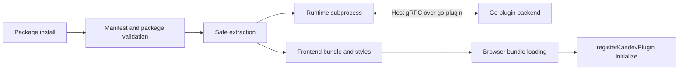

# Authoring a Plugin

This is the canonical developer entry point for Kandev runtime plugins. Use it
to choose a supported surface, edit manifest.yaml, implement the backend or
native UI, package it, and test it against a disposable development instance.
The [plugin manifest reference](plugins-manifest.md) owns field-by-field schema
details; [Plugins](plugins.md) covers operator installation and lifecycle.

The official scaffold is
[kdlbs/kandev-plugin-template](https://github.com/kdlbs/kandev-plugin-template).
Production plugins live in their own repositories. The in-tree fixture is test
support, not a starter repository.

## Quick workflow

1. Choose the closest recipe in this page.
2. Copy the template and edit manifest.yaml: identity, runtime executable, UI
   paths, capabilities, events, webhooks, and config.
3. Implement only through the Go pluginsdk and the frontend registry/Host API.
4. Run the plugin repository tests, vet/lint, and build.
5. Stage the package, run plugin-pack, inspect the archive and generated
   checksums, then install it in a disposable Kandev instance.
6. Smoke-test every declared hook and capability, then bump the version for
   the next iteration.

## Lifecycle


```mermaid
flowchart LR
  A[Package install] --> B[Manifest and package validation]
  B --> C[Safe extraction]
  C --> D[Runtime subprocess]
  D <-->|Host gRPC over go-plugin| E[Go plugin backend]
  C --> F[Frontend bundle and styles]
  F --> G[Browser bundle loading]
  G --> H[registerKandevPlugin initialize]
```

Installation validates the manifest, archive paths, checksums, managed runtime,
and the current host executable before extraction. Kandev then supervises the
declared subprocess and injects a Host connection. The UI bundle is static
package content loaded by the browser; it does not run inside the backend
subprocess. On disable or uninstall, the host calls destroy when present and
bulk-revokes registrations, styles, routes, handlers, and navigation. Reloads and
updates are generation-safe: a slow or failed initialization is not treated as a
definitive revocation, while a successfully ready generation can remove panels it
no longer registers.

## Package and data layout

```text
<id>-<version>.tar.gz
├── manifest.yaml                         # required, validated first
├── server/
│   └── plugin-<goos>-<goarch>[.exe]      # one or more declared binaries
├── ui/
│   ├── bundle.js                          # optional native ES module
│   ├── plugin.css                         # optional styles
│   └── assets/                            # optional files referenced by UI
├── assets/                                # optional manifest icon/assets
├── checksums.txt                          # generated by plugin-pack
└── checksums.txt.sig                      # optional signature
```

runtime.executables maps a platform key such as linux-amd64 to a clean
package-relative path such as server/plugin-linux-amd64. Windows values must
end in .exe. The host platform's key must be present at install time. A
UI-focused plugin still ships a managed backend executable because the current
installer requires runtime.type: binary; that executable can be a no-op
pluginsdk.UnimplementedPlugin server.

Kandev injects KANDEV_PLUGIN_DATA_DIR into the subprocess. It is the durable,
per-plugin directory for arbitrary files or a plugin-owned database:

```text
~/.kandev/plugins/<id>/data/
```

The directory is shared across installed versions, survives restarts and
upgrades, and is removed on uninstall. Keep small structured values in Host
state instead, and never write arbitrary files elsewhere in the Kandev data
directory.

## Choose a plugin shape

| Shape | Package contents | Typical contract | Minimal capability set |
| --- | --- | --- | --- |
| Backend plugin | Go binary and manifest | events, webhooks, Host data, state, secrets, or utility-agent calls | only the capabilities used by the backend |
| UI-focused plugin | no-op managed binary, ui/bundle.js, optional styles/assets | routes, nav, named slots, WebSocket handlers, keybindings, shared store | ui.bundle; add ui.keybindings when declaring shortcuts |
| Combined plugin | Go binary plus UI bundle | UI calls a declared webhook or backend API; backend uses Host | union of the two surfaces, kept least-privilege |

There is no separate HTTP server to launch. pluginsdk.Serve owns the
go-plugin/gRPC handshake and Host injection. The backend implements
pluginsdk.Plugin (OnEvent and/or HandleWebhook) and embeds
pluginsdk.UnimplementedPlugin for no-op defaults.

## Security and capabilities

Plugins are privileged installed code. The capability list gates Host RPCs; it
is not an operating-system sandbox. A backend subprocess inherits the Kandev
process environment, and a UI bundle runs as same-origin JavaScript with the
curated React, UI, and app-store surface.

- Plugins do not receive direct database access. Use typed Host readers/writers,
  Host state, secrets, events, and the data directory. Do not import Kandev
  internal/... packages or call undocumented REST endpoints.
- state gates Host state; secrets gates RevealSecret and plugin-owned secret
  methods; each api_read resource gates its reader; api_write gates
  task/message mutations; agent_invoke gates utility-agent calls; and
  capabilities.events controls event delivery.
- GetConfig and EmitEvent are ungated. GetConfig returns this plugin's own
  config, including cleartext secret fields, so do not log or commit it.
- Declared webhook keys are routable, but Kandev does not authenticate callers
  or enforce webhooks[].method. Validate the method, provider signature, and
  replay/timestamp rules inside the plugin before side effects.
- capabilities.auth is the highest-risk capability. A webhook response may
  assert a verified external identity with X-Kandev-Auth-Login; only assert an
  email the IdP verified as owned by the subject. See [ADR 0050](../decisions/0050-plugin-external-auth-capability.md).

## Storage decision table

| Need | Use | Scope/lifecycle | Capability or rule |
| --- | --- | --- | --- |
| Small JSON object owned by this plugin | Host state: GetState, SetState, DeleteState, ListState | instance, workspace, task, or agent; survives restart/upgrade and is included in Kandev state backups | capabilities.state: true; values are JSON objects, not bare scalars |
| Per-user browser/plugin storage | host.storage: get/set/delete/list/subscribe | instance, workspace, task, session, or repository, scoped per user | capabilities.user_state: true; set/delete accept ifUnmodifiedSince and writerId |
| Operator configuration | Host.GetConfig and manifest config_schema | Plugin-owned settings; config changes restart an active subprocess | Ungated GetConfig; secret fields arrive cleartext in the subprocess |
| Plugin-owned credentials | Host.GetSecret/SetSecret/DeleteSecret, or secret: true config fields | Encrypted Kandev vault, namespaced to this plugin | capabilities.secrets: true; never log values |
| Files, caches, or plugin-managed database | KANDEV_PLUGIN_DATA_DIR | Shared across versions, removed on uninstall | Write only below the injected directory; own schema, locking, and migrations |

Host state is not host.storage: Host state is plugin-scoped backend state with
no transaction primitive, so design updates to be idempotent; host.storage
(below) is per-user, per-scope frontend storage with an optional
ifUnmodifiedSince compare-and-swap.

## Authoritative contracts

The guide summarizes the contract for discovery. These files remain the source
of truth and must be updated together when the contract changes:

- Frontend contract pair: docs/plans/plugins/PLUGIN-API.md and apps/web/lib/plugins/types.ts.
- Concrete frontend Host exports: apps/web/lib/plugins/host-api.ts.
- Backend author API: apps/backend/pkg/pluginsdk.
- Wire contract: apps/backend/proto/kandev/plugin/v1/plugin.proto.
- Manifest model and semantic validation: apps/backend/internal/plugins/manifest.
- Package integrity and installation: apps/backend/internal/plugins/pkgtar.
- Durable decisions: [ADR 0043](../decisions/0043-plugin-host-data-api.md), [ADR 0047](../decisions/0047-plugin-host-conversation-reads.md), [ADR 0048](../decisions/0048-plugin-host-utility-agent-invoke.md), and [ADR 0050](../decisions/0050-plugin-external-auth-capability.md).

## Frontend contract

### Loading and cleanup

The package's ui.bundle is a hand-written ES module. When active, Kandev loads
it and the bundle calls:

```js
window.registerKandevPlugin("my-plugin", {
  initialize(registry, host) {},
  destroy() {},
});
```

initialize receives a registry scoped to this plugin and a PluginHostApi. The
host may call initialize more than once across disable/enable cycles. Make it
repeatable; return a cleanup function from subscriptions and timers, and use
destroy to remove side effects that are not registrations. The host revokes all
registry entries, closes plugin modals, and removes plugin styles on
disable/uninstall. Reloads can temporarily leave a plugin in a loading or failed
state; open and saved panels remain until the current generation is ready. A
ready generation that no longer registers a panel closes it, while an explicit
disable or uninstall closes every panel owned by the plugin. This lifecycle
bookkeeping is host-internal; plugins do not call lifecycle methods.

### Frontend hook/API matrix

| Surface | Location and input | Manifest requirement | Cleanup/lifecycle | Small example |
| --- | --- | --- | --- | --- |
| registerRoute | registry.registerRoute(path, Component, options?); exact SPA path; options.topbar defaults to host chrome or false for full-bleed | Active ui.bundle | Route is removed on disable/uninstall; use destroy for subscriptions | registry.registerRoute("/acme", Page, { topbar: { title: "Acme" } }) |
| registerNavItem | { id, label, path, icon?, section? }; section is main, integrations, or accepted-but-not-rendered settings | Active ui.bundle | Nav item is revoked and removed from desktop/phone navigation | registry.registerNavItem({ id: "home", label: "Acme", path: "/acme", icon: "chart" }) |
| registerSettingsRoute | registerSettingsRoute(fullPath, Component) with an exact path under /settings/plugins/<id>/...; settings shell supplies chrome | Active ui.bundle | Route is removed on disable/uninstall | registry.registerSettingsRoute("/settings/plugins/acme/health", HealthPage) |
| registerComponent | registerComponent(slot, Component); component receives { slotProps?: unknown } | Active ui.bundle | Every registration is owner-tracked, error-isolated, and bulk-revoked | registry.registerComponent("task-sidebar", Panel) |
| registerWsHandler | registerWsHandler(action, handler(payload)); receives actions bridged from lib/ws | Active ui.bundle | Handler is removed on disable/uninstall; tolerate duplicate/replayed actions | registry.registerWsHandler("acme.updated", renderUpdate) |
| registerKeybinding | registerKeybinding(id, handler(event)); id must be declared in ui.keybindings; users can override the effective combo | ui.bundle and ui.keybindings[] | Handler is removed on disable/uninstall; editable targets/core shortcuts win | registry.registerKeybinding("open-panel", () => host.openModal(...)) |
| registerTaskPanel | { id, title, icon?, Component, mobileEnabled? }; adds a row to the task workspace's "+" (add panel) menu; Component receives { panelId, taskId, sessionId, presentation } | Active ui.bundle | Panel renders behind its own error boundary; slow/failed reloads preserve it, a ready generation missing it closes it, and disable/uninstall closes every owned instance | registry.registerTaskPanel({ id: "notes", title: "Notes", Component: NotesPanel }) |
| registerTaskMenuAction | { id, label, icon?, group: "edit" \| "primary", visible?(context), run(context) }; "edit" nests inside the card's Edit submenu, "primary" renders as a flat top-level item between "Move to"/"Send to workflow" and "Link" | Active ui.bundle | Action is revoked on disable/uninstall; a throwing/rejecting run is caught and logged | registry.registerTaskMenuAction({ id: "enhance", label: "Enhance", group: "edit", run: doEnhance }) |
| registerTaskFilter | { id, label, hidden?, getOptions(), matches(context, selected) }; adds a client-side, multi-select filter section to the kanban board's display dropdown, alongside Workflow/Repository | Active ui.bundle | Filter is revoked on disable/uninstall; selections are ephemeral (not persisted); matches is only called for a non-empty selection, and a throw is caught, logged, and treated as non-matching; `hidden: true` omits the built-in dropdown section (matches() still gates as normal) for a plugin that drives its own filter UI via `host.taskFilters` | registry.registerTaskFilter({ id: "tags", label: "Tags", getOptions: listTagOptions, matches: taskHasSelectedTag }) |
| host.React / host.jsx | Shared React instance and React.createElement alias | Active ui.bundle | No cleanup; never bundle a second React/Radix runtime | const h = host.jsx |
| host.store | Curated Zustand { getState, setState, subscribe } for the live app store | Active ui.bundle | Unsubscribe in destroy; setState mutates the whole SPA and is not a plugin database | const stop = host.store.subscribe(render) |
| host.api.fetch / baseUrl | fetch(path, init?) is scoped to /api/plugins/<id>/...; baseUrl is the backend origin for split-origin deployments | Active ui.bundle; backend path must be a declared webhook when relayed | Abort/ignore requests after destroy; do not assume a webhook authenticates callers | host.api.fetch("webhooks/inbound", { method: "POST" }) |
| host.storage | Authenticated, per-user key/value storage: get(scope, scopeId, key)/set(scope, scopeId, key, value, options?)/delete(scope, scopeId, key)/list(scope, scopeId)/listByKey(scope, key, options?) plus subscribe(filter, handler); no plugin backend required | capabilities.user_state: true | set/delete accept an optional writerId (appended to the host's per-tab id, not a replacement) for echo suppression; list returns every entry under the scope pair, unpaginated; listByKey scans across every scopeId for a fixed key (e.g. every task carrying a given tag id), server-capped, returning { entries, truncated } | host.storage.set("task", taskId, "note", value, { writerId: panelId }) |
| host.taskFilters | getSelection(id)/setSelection(id, values)/subscribe(listener) for this plugin's own registerTaskFilter registrations — the same selection the built-in dropdown reads | Active ui.bundle | Namespaced internally to `${pluginId}:${id}`; pair with `hidden: true` on the registration to drive a plugin-owned filter UI instead of the built-in section | host.taskFilters.setSelection("tags", selectedTagIds) |
| host.ui | Curated host instances: Alert*, Badge, Button, Card*, Checkbox, Dialog*, DropdownMenu*, Input, Label, Pagination*, ScrollArea, Select*, Separator, Sheet*, Skeleton, Spinner, Switch, Table*, Tabs*, Textarea, Tooltip*, RichTextEditor, RichTextReadOnly, plus Combobox, PageTopbar, TaskCreateDialog | Active ui.bundle | Host owns contexts/portals; render with host React and let modal/slot cleanup run | const Button = host.ui.Button |
| host.theme | Current "light" or "dark" theme | Active ui.bundle | Read during render; subscribe through host/app patterns if theme-sensitive | host.theme === "dark" |
| host.navigate | Soft SPA navigation navigate(href, { replace? }) | Active ui.bundle | No registry cleanup; avoid navigating to undeclared external origins | host.navigate("/t/" + taskId) |
| host.openModal | Host-owned modal: { title?, content, size?, dismissible? } -> { close() } | Active ui.bundle | Modal auto-closes on disable/uninstall; close handles are idempotent | const modal = host.openModal({ content: Panel }) |

### Supported named slots

registerComponent currently has these mounted slots. The source type is open
to strings, but an unmounted name renders nowhere.

| Slot | Mounted location | slotProps |
| --- | --- | --- |
| task-sidebar | Bottom of task-detail sidebar | none |
| settings-nav | Settings navigation tree | none |
| chat-input-actions | Chat composer toolbar | { taskId, taskTitle?, activeSessionId, sessionIds } |
| chat-top-bar | Session top bar | { taskId, taskTitle?, workspaceId, activeSessionId, sessionIds } |
| main-top-bar | Home/Kanban/Tasks top bar | { workspaceId, workspaceLabel?, currentPage } |
| app-status-bar-left | Left side of desktop status bar or mobile status drawer | AppStatusBarSlotProps |
| app-status-bar-right | Right side of desktop status bar or mobile status drawer | AppStatusBarSlotProps |
| plugin-settings | Top of this plugin's Settings > Plugins page | { pluginId, status }; owner-scoped to the plugin being viewed |
| task-card-indicators | Kanban card, beside the PR status icon | { taskId, workspaceId, workflowStepId } |
| task-card-tags | Kanban card, its own row below the badges row | { taskId, workspaceId, workflowStepId } |

AppStatusBarSlotProps is { placement, presentation, density, pathname,
activeWorkspaceId, activeTaskId, activeSessionId }. Desktop presentation is a
compact 24px bar; mobile presentation is an in-flow drawer, so render a
touch-usable row. Status items can be reordered by the host; plugins do not get
an ordering API.

## Backend contract

### Plugin lifecycle surface

| Surface | Input/output | Manifest capability or declaration | Lifecycle/cleanup | Example |
| --- | --- | --- | --- | --- |
| Plugin.OnEvent | OnEvent(ctx, *pluginsdk.Event) error; event has EventID, EventType, OccurredAt, WorkspaceID, Payload | Matching capabilities.events subject/pattern | Delivery is sequential per plugin with bounded queue and retries; make handlers idempotent by EventID and reconcile critical state | if event.EventType == "task.created" { ... } |
| Plugin.HandleWebhook | HandleWebhook(ctx, *pluginsdk.WebhookRequest) (*WebhookResponse, error); request includes key, method, path, query, headers, body | webhooks[].key; auth additionally required for login assertion header | Undeclared keys are 404; GET/POST are relayed; validate method/signature and bound side effects | if req.WebhookKey == "inbound" { ... } |
| Host.EmitEvent | EmitEvent(ctx, name, payload) publishes plugin.<id>.<name> | None; intentionally ungated | Subscribers must declare the emitted subject; use versioned names/payloads | host.EmitEvent(ctx, "sync.completed", payload-map) |

Event delivery is best-effort: Kandev makes the initial attempt plus retries
with 5s, 15s, and 45s delays, and a bounded in-memory queue/error buffer can
drop events during sustained overload or restart. Use EventID for deduplication
and a source-of-truth reconciliation path when loss matters. The full
subscription vocabulary and wildcard rules are in the
[manifest reference](plugins-manifest.md#event-subscription-vocabulary).

### Host API matrix

| Host surface | Methods | Required manifest capability | Notes |
| --- | --- | --- | --- |
| State | GetState, SetState, DeleteState, ListState | state: true | Plugin-scoped JSON objects keyed by scope/scopeID/key; no transactions |
| Config | GetConfig | None | Reads this plugin's validated config_schema; secret fields are cleartext in the subprocess; config updates restart active plugins |
| Secrets | RevealSecret, GetSecret, SetSecret, DeleteSecret | secrets: true | Encrypted vault; plugin-owned keys are namespaced; never log values |
| Tasks | Tasks().List, Tasks().Get | api_read: tasks | Typed DTOs and opaque pagination cursor |
| Tasks writes | Tasks().Create, Tasks().Update | api_write: tasks | Implemented; routed through Kandev services so events/WS updates fire |
| Sessions | Sessions().List, Sessions().CodeStats | api_read: sessions | Typed session and computed code-stat records |
| Workspaces | Workspaces().List | api_read: workspaces | Instance-visible workspaces |
| Workflows | Workflows().List, Workflows().ListSteps | api_read: workflows | List steps by workflow id |
| Agent profiles | AgentProfiles().List | api_read: agent_profiles | Global agent profiles exposed by the Host data API |
| Repositories | Repositories().List | api_read: repositories | List by workspace id |
| Messages | Messages().List | api_read: messages | Historical user/agent content; Kandev system blocks are stripped |
| Message send | Messages().Send | api_write: messages | Sends a prompt to a task session and records plugin:<id> author |
| Utility agent | InvokeUtilityAgent(ctx, prompt) | agent_invoke: true plus config_schema.utility_agent (format: utility-agent) | One-shot completion using the operator-selected utility agent; missing selection is FailedPrecondition |

The Go signatures, filters, DTOs, and pagination types live in
apps/backend/pkg/pluginsdk/host.go and data_types.go. api_write task/message
methods are implemented in the current branch; do not repeat older docs that
call them reserved.

Host calls are request-scoped rather than registrations: pass the handler
context, handle cancellation, and close any files or external clients created
by the plugin. There is no Host cleanup callback. Typical calls are
`host.SetState(ctx, "task", taskID, "note", value)`,
`host.Tasks().List(ctx, filter, page)`,
`host.Tasks().Create(ctx, pluginsdk.CreateTaskInput{...})`,
`host.Messages().Send(ctx, taskID, sessionID, text)`, and
`host.InvokeUtilityAgent(ctx, prompt)`; each fails with `PermissionDenied`
when its manifest capability is absent.

## Task-oriented recipes

The snippets below are deliberately small. Keep the full template Makefile and
release workflow from the official scaffold.

The maintained in-tree fixture shows the same surfaces end to end: its
[Go backend](../../apps/backend/cmd/plugin-fixture/plugin.go),
[manifest](../../apps/backend/cmd/plugin-fixture/fixture-package/manifest.yaml),
and [native bundle](../../apps/backend/cmd/plugin-fixture/fixture-package/ui/bundle.js)
are the source examples used by the package and browser tests.

### 1. UI-focused plugin

Use a no-op backend because the managed installer requires a host executable.

```yaml
# manifest.yaml
id: "acme-dashboard"
api_version: 1
version: "0.1.0"
display_name: "Acme Dashboard"
runtime:
  type: binary
  executables:
    linux-amd64: server/plugin-linux-amd64
ui:
  bundle: "/ui/bundle.js"
```

```go
// server/main.go
package main

import "github.com/kandev/kandev/pkg/pluginsdk"

func main() { pluginsdk.Serve(&pluginsdk.UnimplementedPlugin{}) }
```

```js
// ui/bundle.js
window.registerKandevPlugin("acme-dashboard", {
  initialize(registry, host) {
    function Page() {
      return host.jsx("main", null, "Acme dashboard");
    }
    registry.registerRoute("/acme-dashboard", Page);
    registry.registerNavItem({ id: "home", label: "Acme", path: "/acme-dashboard", icon: "chart" });
  },
});
```

### 2. Go backend with Host state

Declare state, embed the no-op base, and read the Host at handling time because
the broker connection may not exist during construction.

```yaml
capabilities:
  events: ["task.created", "task.state_changed"]
  state: true
```

```go
import (
  "context"
  "errors"
)

type plugin struct{ pluginsdk.UnimplementedPlugin }

func (p *plugin) OnEvent(ctx context.Context, event *pluginsdk.Event) error {
  if event == nil || event.EventID == "" { return errors.New("event ID is required") }
  host := p.Host()
  if host == nil { return errors.New("plugin host unavailable") }
  value, found, err := host.GetState(ctx, "instance", "", "events")
  if err != nil { return err }
  if !found { value = map[string]any{} }
  processed, _ := value["processed_event_ids"].(map[string]any)
  if processed == nil { processed = map[string]any{} }
  if _, seen := processed[event.EventID]; seen { return nil }
  count := 0.0
  if found { count, _ = value["count"].(float64) }
  processed[event.EventID] = true
  value["processed_event_ids"] = processed
  value["count"] = count + 1
  return host.SetState(ctx, "instance", "", "events", value)
}
```

The durable EventID claims make retries no-ops. Delivery is sequential per
plugin, while Host state itself has no transaction primitive; keep the claim
and counter in one state update and bound or prune old claims in a long-lived
plugin.

### 3. Task panel with task-scoped Host state

There is now a real `registerTaskPanel` and per-user `host.storage`; prefer
them over the old task-sidebar-plus-webhook workaround.

```yaml
capabilities:
  user_state: true
```

```js
function useNoteValue(taskId, panelId) {
  const [value, setValue] = host.React.useState("");
  const [loadedTaskId, setLoadedTaskId] = host.React.useState(null);
  const [readError, setReadError] = host.React.useState(false);
  const updatedAtRef = host.React.useRef(undefined);
  const dirtyRef = host.React.useRef(false);
  // Holds cancellation/generation state outside the effect so `refresh` is a
  // stable function the conflict-refetch below can also call, instead of
  // duplicating the read-and-commit logic without its guards.
  const guardRef = host.React.useRef({ cancelled: false, generation: 0 });

  const refresh = host.React.useCallback((options = {}) => {
    const preserveValue = options.preserveValue ?? dirtyRef.current;
    const guard = guardRef.current;
    const generation = ++guard.generation;
    return host.storage.get("task", taskId, "note").then(
      (entry) => {
        // Ignore a response that resolves after taskId changed, the panel
        // unmounted, or a newer refresh started — otherwise a stale read
        // (the previous task's note, or one of two overlapping reads that
        // resolved out of order) can land in the current field.
        if (guard.cancelled || generation !== guard.generation) return;
        if (!preserveValue && !dirtyRef.current) setValue(entry ? entry.value : "");
        updatedAtRef.current = entry ? entry.updatedAt : undefined;
        setLoadedTaskId(taskId);
        setReadError(false);
        return true;
      },
      () => {
        // Do not mark the task loaded after a rejected read. Rendering an
        // empty editor here would allow its first save to omit
        // ifUnmodifiedSince and overwrite an existing note. Keep the panel
        // in a retry state until an authoritative read succeeds.
        if (guard.cancelled || generation !== guard.generation) return false;
        setReadError(true);
        return false;
      },
    );
  }, [taskId]);

  host.React.useEffect(() => {
    const guard = guardRef.current;
    guard.cancelled = false;
    // Clear the previous task's value/timestamp synchronously — otherwise it
    // stays on screen (and could be sent as ifUnmodifiedSince under the new
    // taskId) until this effect's first refresh() resolves.
    setValue("");
    updatedAtRef.current = undefined;
    dirtyRef.current = false;
    setLoadedTaskId(null);
    setReadError(false);
    refresh();
    // Scope echo suppression to this panel instance rather than the shared
    // per-tab default writer id — otherwise a second surface editing the
    // same note (a kanban shortcut, another panel) looks like this panel's
    // own echo and its write never arrives here.
    const unsubscribe = host.storage.subscribe(
      { scope: "task", scopeId: taskId, key: "note", writerId: panelId },
      refresh,
    );
    return () => {
      guard.cancelled = true;
      unsubscribe();
    };
  }, [taskId, panelId, refresh]);
  return {
    value,
    setValue,
    updatedAtRef,
    dirtyRef,
    loaded: loadedTaskId === taskId,
    readError,
    refresh,
  };
}

function NotesPanel({ taskId, panelId }) {
  const { value, setValue, updatedAtRef, dirtyRef, loaded, readError, refresh } = useNoteValue(
    taskId,
    panelId,
  );
  const [conflict, setConflict] = host.React.useState(false);
  const [writeError, setWriteError] = host.React.useState(false);
  const pendingValueRef = host.React.useRef(undefined);
  const writeTimerRef = host.React.useRef(undefined);
  const writeInFlightRef = host.React.useRef(false);
  const writeBlockedRef = host.React.useRef(false);
  const writeGenerationRef = host.React.useRef(0);

  const flushWrite = host.React.useCallback(() => {
    if (
      writeBlockedRef.current ||
      writeInFlightRef.current ||
      pendingValueRef.current === undefined
    ) {
      return;
    }
    const generation = writeGenerationRef.current;
    const next = pendingValueRef.current;
    pendingValueRef.current = undefined;
    writeInFlightRef.current = true;
    host.storage
      .set("task", taskId, "note", next, {
        writerId: panelId,
        ifUnmodifiedSince: updatedAtRef.current,
      })
      .then((result) => {
        if (writeGenerationRef.current !== generation) return;
        updatedAtRef.current = result.updatedAt;
        dirtyRef.current = pendingValueRef.current !== undefined;
        setConflict(false);
        setWriteError(false);
      })
      .catch((error) => {
        if (writeGenerationRef.current !== generation) return;
        // Stop the queue on a conflict. Refresh only the authoritative
        // timestamp and preserve the local value so the user can choose
        // whether to retry their edit; never replace dirty text silently.
        pendingValueRef.current = pendingValueRef.current ?? next;
        writeBlockedRef.current = true;
        if (error.name === "PluginStorageConflictError") {
          setConflict(true);
          return refresh({ preserveValue: true });
        }
        setWriteError(true);
      })
      .finally(() => {
        if (writeGenerationRef.current !== generation) return;
        writeInFlightRef.current = false;
        if (!writeBlockedRef.current && pendingValueRef.current !== undefined) {
          writeTimerRef.current = setTimeout(() => {
            if (writeGenerationRef.current !== generation) return;
            writeTimerRef.current = undefined;
            flushWrite();
          }, 150);
        }
      });
  }, [dirtyRef, panelId, refresh, taskId, updatedAtRef]);

  const scheduleWrite = host.React.useCallback(() => {
    if (writeBlockedRef.current || writeTimerRef.current !== undefined) return;
    const generation = writeGenerationRef.current;
    writeTimerRef.current = setTimeout(() => {
      if (writeGenerationRef.current !== generation) return;
      writeTimerRef.current = undefined;
      flushWrite();
    }, 150);
  }, [flushWrite]);

  const retryWrite = host.React.useCallback(async () => {
    if (!(await refresh({ preserveValue: true }))) return;
    writeBlockedRef.current = false;
    setConflict(false);
    setWriteError(false);
    scheduleWrite();
  }, [refresh, scheduleWrite]);

  host.React.useEffect(() => {
    const generation = ++writeGenerationRef.current;
    pendingValueRef.current = undefined;
    writeInFlightRef.current = false;
    writeBlockedRef.current = false;
    setConflict(false);
    setWriteError(false);
    return () => {
      if (writeGenerationRef.current === generation) writeGenerationRef.current += 1;
      pendingValueRef.current = undefined;
      writeInFlightRef.current = false;
      writeBlockedRef.current = false;
      if (writeTimerRef.current !== undefined) clearTimeout(writeTimerRef.current);
      writeTimerRef.current = undefined;
    };
  }, [taskId, panelId]);

  if (readError) {
    return host.jsx(
      "button",
      { type: "button", onClick: refresh },
      "Could not load this note. Retry",
    );
  }
  if (!loaded) return host.jsx("div", null, "Loading...");
  const editor = host.jsx(host.ui.RichTextEditor, {
    taskId,
    value,
    onChange: (next) => {
      setValue(next);
      dirtyRef.current = true;
      pendingValueRef.current = next;
      scheduleWrite();
    },
  });
  const status = conflict
    ? host.jsx(
        "div",
        null,
        "This note changed elsewhere. Your edit is preserved.",
        host.jsx("button", { type: "button", onClick: retryWrite }, "Retry my edit"),
      )
    : writeError
      ? host.jsx(
          "div",
          null,
          "Could not save this note.",
          host.jsx("button", { type: "button", onClick: retryWrite }, "Retry"),
        )
      : null;
  return host.jsx("div", null, editor, status);
}

registry.registerTaskPanel({ id: "notes", title: "Notes", icon: "book", Component: NotesPanel, mobileEnabled: true });
```

On a phone, all `mobileEnabled` panels appear under one **Panels** bottom-nav
action. The picker uses a touch-sized, internally scrolling sheet with each
panel's icon and title; selecting a row dismisses the picker and focuses that
panel as the single full-height mobile surface. The component receives
`presentation: "mobile"`; desktop dockview receives `presentation: "desktop"`.
The same registration and panel identity drive both viewports, so a panel remains
selected through a slow or failed reload and is closed only after a ready
generation omits it or the plugin is explicitly disabled/uninstalled.

`writerId` is appended to the host's own per-tab id, not a full replacement —
a static value like `panelId` is the same across every tab that has that
panel open, so two different tabs subscribing with the same raw `panelId`
would otherwise suppress each other's real, cross-tab updates as if they were
local echoes. Pass `ifUnmodifiedSince` (the `updatedAt` from the last `get`)
to `set` and handle the resulting `409` by refetching, rather than silently
discarding a concurrent edit. `host.storage.list` returns every entry under a
`(scope, scopeId)` pair with no pagination — fine for a handful of keys per
task, not for an unbounded per-item collection.

### 4. Webhook receiver

Declare the route, validate the method and provider signature inside the
backend, and return a bounded status/body. Kandev caps incoming bodies at 4 MiB
but does not authenticate the caller.

```yaml
webhooks:
  - key: "provider-events"
    description: "Provider event callback"
    method: "POST" # informational; enforce it in HandleWebhook
```

```go
func (p *plugin) HandleWebhook(ctx context.Context, req *pluginsdk.WebhookRequest) (*pluginsdk.WebhookResponse, error) {
  if req.WebhookKey != "provider-events" || req.Method != http.MethodPost {
    return &pluginsdk.WebhookResponse{Status: http.StatusNotFound}, nil
  }
  if !validProviderSignature(req.Headers, req.Body) {
    return &pluginsdk.WebhookResponse{Status: http.StatusUnauthorized}, nil
  }
  // Decode, deduplicate, and enqueue the event before returning.
  return &pluginsdk.WebhookResponse{Status: http.StatusAccepted}, nil
}
```

### 5. Event subscriber

Subscribe to exact subjects or one-segment wildcards and make processing
idempotent by EventID.

```yaml
capabilities:
  events: ["task.created", "task.state_changed"]
```

```go
func (p *plugin) OnEvent(ctx context.Context, event *pluginsdk.Event) error {
  // Apply the durable EventID claim pattern from the Host-state recipe before
  // performing side effects.
  if event.EventType == "task.created" { return p.handleTask(ctx, event.Payload) }
  return nil
}
```

For critical workflows, periodically reconcile from host.Tasks() or another
Host reader because event queues are bounded and delivery is best-effort.

### 6. Kanban-aware contribution

`registerTaskMenuAction` adds an item to the kanban card's context/dropdown
menu — group `"edit"` nests it inside the `Edit` submenu, group `"primary"`
renders it as a flat, top-level item positioned between the "Move
to"/"Send to workflow" submenus and the "Link" submenu.
`task-card-indicators` (see the named slots table) is the matching read-only
surface, rendered beside the PR status icon on every card. `task-card-tags`
is a sibling read-only surface with the same `slotProps` shape, mounted in its
own row instead of that cramped title-row spot — reach for it when a
contribution (e.g. a row of tag chips) needs its own width. Both
`visible(context)` and `run(context)` receive the card's actual `presentation`:
`"desktop"` on the desktop kanban and `"mobile"` on the phone kanban. Use it
when an action needs to choose responsive behavior; the host supplies it
through the card composition.

```js
registry.registerTaskMenuAction({
  id: "enhance-notes",
  label: "Enhance notes",
  group: "edit",
  visible: (context) => Boolean(context.taskId),
  run: async (context) => {
    await host.storage.set("task", context.taskId, "note", "...");
  },
});
```

With no plugin action registered, the card's `Edit` item stays flat; once any
plugin registers one for group `"edit"`, it becomes `Edit > Edit task`
followed by each visible action. A `run` that throws or rejects is caught and
logged, not left to crash the card; the menu closes either way. Group
`"primary"` actions render and behave the same way, just as their own
top-level menu row instead of nested under `Edit`. Do not patch first-party
Kanban components directly.

`registerTaskFilter` adds a client-side, multi-select filter section to the
kanban board's display dropdown, next to the built-in Workflow and Repository
sections. The plugin supplies its own options (including any "untagged"-style
sentinel — the host does not special-case option values) and a `matches`
predicate; filtering runs entirely against tasks already loaded in the
board's in-memory state, with no backend query or persistence — selections
reset on reload.

```js
registry.registerTaskFilter({
  id: "tags",
  label: "Tags",
  getOptions: () => [
    { value: "bug", label: "Bug", color: "#ef4444" },
    { value: "untagged", label: "Untagged" },
  ],
  matches: (context, selected) => taskHasAnyTag(context.taskId, selected),
});
```

An empty selection is implicit "All" for that section — `matches` is only
called once at least one option is selected, and a `matches` that throws is
caught, logged, and treated as non-matching for that task.


## Build, package, install, and test

### Plugin repository

From the plugin repository created from the official template:

```bash
go test ./...
go vet ./...
make package-host       # local platform, fastest loop
make package            # all platforms declared by the template
```

The template's package target stages manifest.yaml, server/, ui/, and assets,
then runs the monorepo plugin-pack command. If using a custom Makefile, the
equivalent is:

```bash
rm -rf .build/stage
mkdir -p .build/stage/server
cp manifest.yaml .build/stage/manifest.yaml
if [ -d ui ]; then cp -R ui .build/stage/ui; fi
if [ -d assets ]; then cp -R assets .build/stage/assets; fi
go build -o .build/stage/server/plugin-$(go env GOOS)-$(go env GOARCH) ./server
go run github.com/kandev/kandev/cmd/plugin-pack \
  -dir .build/stage \
  -out acme-dashboard-0.1.0.tar.gz \
  -platform-only
```

plugin-pack requires manifest.yaml, rejects pre-supplied checksum files, and
generates checksums.txt. It is a packager, not an exhaustive semantic or
JavaScript validator: it does not execute the plugin or prove every referenced
UI asset is valid.

### In-tree fixture validation

The monorepo provides a maintained package smoke path without a production
instance:

```bash
make -C apps/backend e2e-plugin-package
cd apps/backend
go test ./cmd/plugin-pack ./cmd/plugin-fixture ./internal/plugins/manifest \
  ./internal/plugins/pkgtar ./pkg/pluginsdk
```

The fixture build proves the current SDK/package shape and produces a
host-platform archive. pkgtar.Install is the install-time authority for manifest
validity, safe archive paths, checksums, managed runtime, and the host
executable. It also extracts the package; it does not run the plugin or perform
a full browser/module build.

### Disposable-instance smoke test

Install the archive through Settings > Plugins or the local API:

```bash
curl -F "package=@acme-dashboard-0.1.0.tar.gz" \
  http://localhost:38429/api/plugins/install
```

Then enable it, open each registered route, exercise every declared webhook or
event, verify denied capabilities fail as expected, and disable/re-enable to
confirm destroy and state preservation. Uninstall only in a disposable
instance; it removes the plugin package and KANDEV_PLUGIN_DATA_DIR.

Reinstalling the same id/version is rejected. Bump version or uninstall before
repackaging.

| Layer | Command/source | Checks | Does not check |
| --- | --- | --- | --- |
| Source | go test, go vet, template lint/build | Backend compilation and tests | Package paths or browser runtime |
| Package | plugin-pack | Manifest presence, safe staging, generated checksums | Full manifest semantics, JS execution, live Host calls |
| Install | pkgtar.Install via upload/sideload | Manifest validation, archive safety, checksums, managed runtime, host executable | Plugin behavior or UI rendering |
| Runtime | Disposable instance smoke test | Subprocess, Host permissions, events, webhooks, UI cleanup | Production-scale load/provenance |

## Common mistakes

- **Missing the leading slash:** ui.bundle and ui.styles must be root-relative
  (/ui/bundle.js, /ui/plugin.css), not ui/bundle.js.
- **Forgetting capabilities:** every Host state, secret, data-reader, write, or
  utility-agent call fails with PermissionDenied unless its manifest capability
  is present.
- **Confusing plugin_state with host.storage:** Host state is backend,
  plugin-scoped JSON with no per-user identity; host.storage is per-user.
- **Reusing a raw surface id as writerId:** a static id like panelId is the
  same across every tab that has that surface open. Passed as-is to
  host.storage's writerId, it makes two different tabs look like the same
  writer and suppresses real cross-tab updates as if they were local echoes —
  the host already appends it to a per-tab id, so pass the surface id, not a
  fabricated combined string.
- **Writing outside KANDEV_PLUGIN_DATA_DIR:** arbitrary files belong below the
  injected per-plugin directory; do not write beside the Kandev database or into
  another plugin's directory.
- **Leaving stale frontend registrations:** use destroy, unsubscribe store/WS
  listeners, clear timers, and rely on host bulk revocation after disable or
  uninstall.
- **Importing direct DB/internal packages:** use apps/backend/pkg/pluginsdk and
  typed Host methods. Direct database access is outside the plugin contract.
- **Trusting webhook metadata:** webhooks[].method is informational and the route
  is not authenticated by Kandev. Validate method, signature, timestamp, replay
  protection, and body before side effects.
- **Bundling React:** use host.React, host.jsx, and host.ui; a second React or
  Radix copy breaks shared contexts and portals.
- **Shipping the wrong binary name:** every declared executable must be under
  server/, match its <goos>-<goarch> key, and include .exe on Windows.

Related: [Plugins](plugins.md), [Plugin manifest reference](plugins-manifest.md),
[Plugin marketplace](plugins-marketplace.md), and [Extending Kandev](extending-kandev.md).
