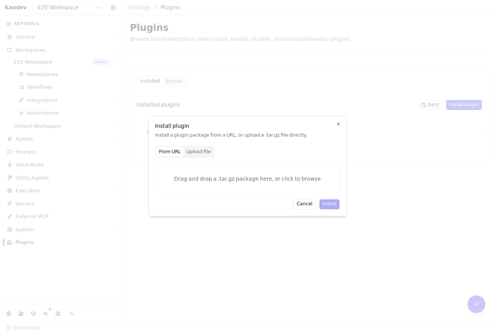
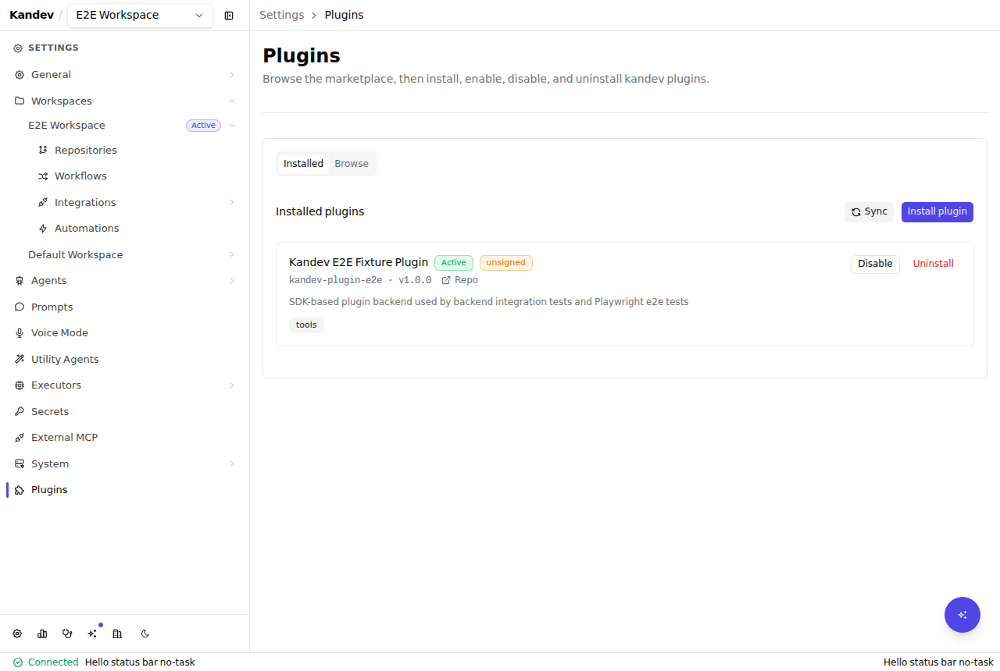
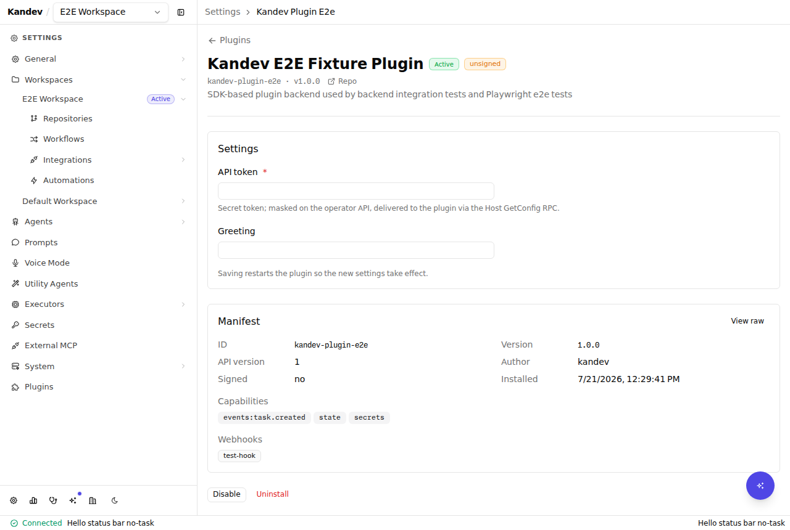

# Plugins

Plugins extend kandev without forking core: a plugin ships a **Go backend**
that kandev spawns and supervises as a subprocess over a strict typed gRPC
protocol, and can optionally ship a **native frontend bundle** that kandev
loads into the SPA. This page covers what plugins are, how to install and
manage them, and the current security posture. To discover and install plugins
from the in-app catalog, see the [Plugin marketplace](plugins-marketplace.md).
For building a plugin, see [Authoring a plugin](plugins-authoring.md). For the
manifest schema, see [Plugin manifest reference](plugins-manifest.md).

Plugins are an operator-level, instance-wide capability — there is no
per-user plugin access. They are gated behind the `plugins` feature flag
(**Settings > System > Feature Toggles**), off by default in production
builds and on by default in dev/e2e builds. Enabling the flag requires a
backend restart and surfaces **Settings > Plugins** in the sidebar.

## How it works


Kandev owns the whole process lifecycle: it extracts the package, spawns the
binary, completes the go-plugin handshake, health-checks it (`Ping` every
30s), and restarts it on crash or repeated health-check failure (backoff,
max 5 attempts). There is no separate operator-managed plugin process to run
or babysit — install a package and kandev does the rest.

A native UI bundle can register a nav item that renders as a top-level
sidebar entry or, when it declares itself part of the Integrations section,
alongside kandev's first-party integration links in the main sidebar's
**Integrations** section — expect new entries to appear there once such a
plugin is installed and active. Bundles can also inject components into
host-defined slots, including **icon buttons in the chat composer toolbar**
(beside the model picker, mic, and send button), so an active plugin can add
its own action right where you message an agent.

### Global Status contributions

Native UI bundles can also add compact, live status UI on every hosted route:

```js
function StatusContribution({ slotProps }) {
  return host.jsx(
    "span",
    null,
    `${slotProps.presentation}: ${slotProps.activeTaskId ?? "no task"}`,
  );
}

registry.registerComponent("app-status-bar-left", StatusContribution);
registry.registerComponent("app-status-bar-right", StatusContribution);
```

Each registration is one opaque item in Kandev's 24 px desktop/tablet status bar
and phone Status drawer. The slot chooses its default side; users can Cmd/Ctrl plus
mouse-drag items across the desktop spacer, and Kandev preserves their order in
backend user settings. Phone shows the saved left sequence followed by the right
sequence, with no drag ordering. `slotProps` includes
`placement`, `presentation`, `density`, `pathname`, `activeWorkspaceId`,
`activeTaskId`, and `activeSessionId`. Only one presentation mounts at once;
adapt each contribution for both compact bar and touch-friendly drawer use.
Kandev does not inspect or reorder children inside a contribution, and disabled
plugins return to their saved position when re-enabled.
Full-bleed routes that opt out of host topbar chrome own their Status trigger.

## Installing a plugin

The easiest way to install is from the in-app catalog — **Settings > Plugins >
Browse**, then **Install** on a card (see the [Plugin
marketplace](plugins-marketplace.md)). To install a plugin that is not in a
configured catalog, open **Settings > Plugins** and click **Install plugin**.
You can install from a URL (kandev downloads the tarball) or by uploading a
`.tar.gz` file directly. No credentials are ever shown or copied — installing a
plugin has nothing to reveal, unlike a webhook-secret/API-key registration
flow.



The same operations are available over HTTP:

```bash
# Install from a URL
curl -X POST http://localhost:38429/api/plugins/install \
  -H 'Content-Type: application/json' \
  -d '{"url": "https://example.com/acme-tools-1.0.0.tar.gz"}'

# Install by uploading a local tarball
curl -X POST http://localhost:38429/api/plugins/install \
  -F "package=@acme-tools-1.0.0.tar.gz"
```

Either path runs the same pipeline:

1. Verify `checksums.txt` covers every other file in the tarball and every
   hash matches (always enforced).
2. Check for `checksums.txt.sig`. Signature verification is not currently
   wired up, so every package — signed or not — installs and is reported
   as unsigned today (see "Signed vs. unsigned packages" below).
3. Parse and validate `manifest.yaml` **before any code runs**: schema, `id`
   pattern, the `categories` and UI-surface enums, and that
   `runtime.executables` contains an entry for the host's OS/arch.
4. Extract to `~/.kandev/plugins/<id>/<version>/` and record the
   installation.
5. Spawn the platform-matched binary and complete the go-plugin handshake.
   Status is `registered` while this is pending, `active` once the
   handshake succeeds, or `error` if spawn/handshake fails (the operator can
   retry via **Enable**).

A successful install that failed to spawn returns HTTP 201 with a
`warning` field rather than failing outright — the package is installed,
just not yet running.

Once installed, the plugin appears in the list with its category, a status
badge (`active`), a signing badge (`unsigned` today), and **Disable** and
**Uninstall** actions:



## Filesystem sideload and Sync

Besides install-by-URL/upload, an operator with shell access to the host can
place plugin content directly under `~/.kandev/plugins/` without going
through the install endpoint. The **Sync** button in Settings > Plugins (and
`POST /api/plugins/sync`) reconciles kandev's registry with what is actually
on disk:

- **A dropped directory** — `~/.kandev/plugins/<id>/<version>/manifest.yaml`
  placed manually with no existing record — is validated and registered
  with status **`disabled`**, never auto-enabled. Directory sideloads skip
  the checksum/integrity gate the URL/upload pipeline runs, so an operator
  must explicitly inspect and enable one. If more than one version
  directory exists for the same unregistered id, the lexically greatest
  version is registered and the others are reported as skipped.
- **A dropped tarball** — any `*.tar.gz` sitting directly in
  `~/.kandev/plugins/` — is run through the same verified install pipeline
  `POST /api/plugins/install` uses. On success the tarball file is deleted;
  on failure it is left in place and the failure is reported.
- **A missing install** — a registered record whose `install_path` no
  longer exists on disk — is stopped (if running) and marked `error`.

At boot, kandev runs only the directory-sideload and missing-install steps
(never the tarball-install step), as part of resuming plugins that were
already active. This is conservative by design: starting up never spawns a
binary an operator hasn't explicitly approved via install or Sync.

## Enable, disable, uninstall

- **Disable** stops the subprocess. Config and state are preserved; no
  events or webhooks are delivered while disabled.
- **Enable** respawns the subprocess and re-completes the handshake.
- **Uninstall** stops the subprocess and deletes the plugin's package,
  registration record, and all persisted state — there is no grace period.

## Per-plugin settings

A plugin can declare `config_schema` in its manifest, generating a settings
form at **Settings > Plugins > `<plugin>`** (also `GET /api/plugins/{id}/config`
and `PATCH /api/plugins/{id}`). Fields marked `secret: true` or
`format: "password"` (for example a GitHub PAT) are never returned in
cleartext to the operator UI — reads show a masked placeholder, and
resubmitting the form unchanged leaves the stored secret alone. The plugin
process itself receives the real values via the `GetConfig` Host RPC.
Saving config **restarts the running plugin** so it re-reads its config.
`<id>.config.yml` on disk is written with mode `0600` and may hold vault
references rather than cleartext for secret fields.



A plugin can also render its own UI inline on this page — at the top, above the
settings form — via the `plugin-settings` slot, for example a live
integration-health card ("CLI installed ✅ v0.45.2", "API token ✅
authenticated"). This is owner-scoped, so a plugin's card only ever appears on
its own settings page. See [Named
slots](plugins-authoring.md#named-slots) in the authoring guide.

## Signed vs. unsigned packages

Every package's `checksums.txt` is verified at install time — this integrity
gate is always enforced. Signing (`checksums.txt.sig`, an ed25519 signature
over `checksums.txt`) is a separate, optional layer, and its verification
hook is not currently wired up in the shipped product: no signature is
cryptographically checked today, so every install — signed tarball or not —
is currently treated and reported as unsigned. A signed package installs
identically to an unsigned one; signing is not required in v1.

## On-disk layout

```
~/.kandev/plugins/
├── <id>.yml                    # registration record (status, install_path, signed, ...)
├── <id>.config.yml             # operator-editable config (PATCH /api/plugins/{id})
└── <id>/
    ├── <version>/              # extracted package (InstallPath)
    │   ├── manifest.yaml
    │   ├── server/plugin-<goos>-<goarch>[.exe]
    │   └── ui/bundle.js         # optional
    └── data/                    # KANDEV_PLUGIN_DATA_DIR — shared across versions
```

## Security posture

- **Auth is the spawn relationship.** Kandev spawns the plugin subprocess
  itself over a unix domain socket (macOS/Linux) or loopback TCP (Windows) —
  never a routable network address — and secures it in both cases with the
  go-plugin handshake plus AutoMTLS. There is no `api_key`, `webhook_secret`,
  or HMAC signing anywhere in the contract.
- **Capability-based access control.** A plugin can only call the Host RPCs
  it declared in its manifest: `state` gates the state RPCs, `secrets` gates
  the plugin-owned secret RPCs, and each read-only data accessor (tasks,
  sessions, workspaces, workflows, agent profiles, repositories) is gated
  individually via `api_read:<resource>` (write access, `api_write:<resource>`,
  is reserved but not yet implemented). An undeclared capability returns gRPC
  `PermissionDenied` with a message naming the missing capability, checked by
  a server interceptor before the handler runs. `GetConfig` and `EmitEvent`
  are the only ungated RPCs — a plugin can always read its own config
  (secrets included) and emit events.
- **Native UI plugins run in-origin with full app-store access.** This is an
  accepted tradeoff, not an oversight: a plugin bundle shares the kandev
  React instance and Zustand store so it can build UI indistinguishable from
  first-party pages. In v1 only **active, operator-installed** plugins load;
  a failing bundle or `initialize` is caught and never breaks boot; slot
  components render behind error boundaries. Hard sandboxing (a worker or
  realm boundary) is explicit future work — see below.
- **Package integrity is always checked; signing is optional.** See
  "Signed vs. unsigned packages" above.
- **Curated marketplace, no auto-install.** The [Plugin
  marketplace](plugins-marketplace.md) adds one-click install from a catalog,
  but the official source is PR-curated (a plugin appears only after a
  maintainer approves it), install is always an explicit operator action, and
  updates require an explicit click — there is no automatic discovery or
  background install. kandev collects no download or usage telemetry.

Related: [Authoring a plugin](plugins-authoring.md), [Plugin manifest
reference](plugins-manifest.md), and [Extending Kandev](extending-kandev.md).
